# Schéma d’Architecture du Système d’Information

Ce schéma d'architecture représente une structure typique du **système d'information** (SI) d'une entreprise, où chaque composante est responsable de domaines spécifiques tels que l'architecture, la sécurité, les réseaux, les données, le cloud et la transformation numérique. Dans le cadre d’une banque, toutes ces composantes doivent interagir harmonieusement pour assurer la continuité et la sécurité des services bancaires.

```mermaid
graph TD
    A[Directeur des Systèmes d'Information] --> B[Architecture]
    A --> C[Sécurité]
    A --> D[Réseaux]
    A --> E[Cloud]
    A --> F[Données]
    A --> G[Transformation Numérique]

    %% Architecture
    B --> B1[Urbanisation SI]
    B --> B2[Architecture Logicielle]
    B --> B3[Architecture Applicative]

    %% Sécurité
    C --> C1[Sécurité SI]
    C --> C2[Conformité et Réglementation]
    C --> C3[Gestion des Identités]

    %% Réseaux
    D --> D1[Réseaux d'Entreprise]

    %% Cloud
    E --> E1[Solutions Cloud]
    E --> E2[Gestion des Risques Cloud]

    %% Données
    F --> F1[Big Data & Analytics]
    F --> F2[Ingénierie des Données]

    %% Transformation Numérique
    G --> G1[Gestion des Projets]
    G --> G2[Transformation Digitale]
    G --> G3[Innovation Technologique]

    %% Détails supplémentaires - Architecture
    B1 --> B1a[Gestion Urbanisation SI]
    B2 --> B2a[Développement Logiciel]
    B3 --> B3a[Gestion des Applications]

    %% Détails supplémentaires - Sécurité
    C1 --> C1a[Conformité SI]
    C2 --> C2a[Gestion des Risques Sécurité]
    C3 --> C3a[Gestion des Identités et Accès]

    %% Détails supplémentaires - Réseaux
    D1 --> D1a[Infrastructure Réseaux]

    %% Détails supplémentaires - Cloud
    E1 --> E1a[Sécurité Cloud]
    E2 --> E2a[Optimisation Cloud]

    %% Détails supplémentaires - Données
    F1 --> F1a[Big Data]
    F1 --> F1b[Analytics Avancée]
    F2 --> F2a[Data Engineering & Pipeline]

    %% Détails supplémentaires - Transformation Numérique
    G1 --> G1a[Gestion des Projets Agile]
    G2 --> G2a[Transformation Digitale des Processus]
    G3 --> G3a[Innovation & R&D]

    %% Ajout de la fonction Urbanisation
    B1 --> B1b[Zonage Fonctionnel]
    B1 --> B1c[Évolution Modulaire du SI]
```

Voici une version améliorée et détaillée de votre texte sur les axes de l'architecture et urbanisation des systèmes d'information, avec un tableau de synthèse complet :

---

### Explications détaillées et exemples

#### 1. **Architecture et Urbanisation SI**

- **Urbanisation SI** : 
  - **Concept** : La structuration du Système d'Information (SI) en **zones fonctionnelles** distinctes pour optimiser la gestion et la flexibilité du SI. Cette approche permet de séparer les différentes activités et processus du SI, facilitant ainsi leur évolution et maintenance.
  - **Exemple Pratique** : Une banque peut diviser son SI en **zones** telles que la **zone de paiement**, la **zone de gestion des crédits**, et la **zone de conformité**. Cette séparation permet de mettre à jour ou d’améliorer chaque zone indépendamment sans affecter les autres parties du système.

- **Architecture Logicielle** : 
  - **Concept** : Organisation des logiciels en **microservices** pour garantir une modularité accrue, facilitant ainsi le déploiement, la maintenance, et l’évolutivité des services.
  - **Exemple Pratique** : Un service de **gestion des prêts** est conçu comme un microservice autonome. Cela permet au service de gestion des prêts de fonctionner indépendamment d'autres services comme ceux des **virements bancaires** ou de la **consultation des soldes**.

- **Architecture Applicative** :
  - **Concept** : Intégration fluide des applications en combinant les **systèmes legacy** avec des **services modernes** via des **API** ou des **middleware**.
  - **Exemple Pratique** : Une application bancaire mobile accède aux systèmes legacy à travers des **API REST** pour obtenir des informations en temps réel sur les transactions.

#### 2. **Sécurité**

- **Sécurité SI** :
  - **Concept** : Mise en œuvre de politiques de sécurité pour protéger les **données sensibles** des clients et assurer la résilience contre les cyberattaques.
  - **Exemple Pratique** : Utilisation de **firewalls**, **systèmes de détection et de prévention des intrusions (IDS/IPS)**, et respect des normes de sécurité comme **ISO/IEC 27001** pour sécuriser l'infrastructure bancaire.

- **Conformité et Réglementation** :
  - **Concept** : Adhésion à des régulations spécifiques pour assurer la protection des données et la gestion des risques financiers.
  - **Exemple Pratique** : Application du **Règlement Général sur la Protection des Données (RGPD)** pour garantir la confidentialité des informations personnelles des clients et le respect des exigences en matière de reporting et de sécurité.

- **Gestion des Identités (IAM)** :
  - **Concept** : Mise en place de solutions pour la gestion des accès et des authentifications afin de contrôler et sécuriser l'accès aux ressources internes.
  - **Exemple Pratique** : Utilisation de **Keycloak** pour gérer les authentifications et les autorisations des employés, assurant que seuls les utilisateurs autorisés ont accès aux systèmes critiques.

#### 3. **Réseaux**

- **Réseaux d'Entreprise** :
  - **Concept** : Gestion des **réseaux internes** pour assurer des échanges sécurisés et efficaces entre les différentes agences et les datacenters.
  - **Exemple Pratique** : Mise en place de **VPN** ou de **MPLS** pour sécuriser les communications entre les différentes succursales d'une banque, garantissant ainsi la confidentialité et l'intégrité des données échangées.

#### 4. **Cloud**

- **Solutions Cloud** :
  - **Concept** : Adoption de services cloud pour améliorer la **scalabilité** et la **disponibilité** des services bancaires.
  - **Exemple Pratique** : Hébergement de la plateforme de **paiement en ligne** sur des services cloud comme **AWS** ou **Microsoft Azure** pour bénéficier d’une gestion centralisée, d'une disponibilité mondiale, et de sauvegardes automatisées.

- **Gestion des Risques Cloud** :
  - **Concept** : Mise en place de stratégies de sécurité pour protéger les environnements cloud et surveiller les configurations.
  - **Exemple Pratique** : Utilisation d'outils comme **Cloud Security Posture Management (CSPM)** pour suivre les vulnérabilités, gérer les configurations et garantir la conformité des politiques de sécurité dans le cloud.

#### 5. **Données**

- **Big Data & Analytics** :
  - **Concept** : Exploitation des **données massives** pour offrir des services personnalisés et améliorer les stratégies commerciales.
  - **Exemple Pratique** : Analyse des **transactions** des clients en utilisant des outils comme **Hadoop** ou **Spark** pour identifier des opportunités de crédit et proposer des offres ciblées.

- **Ingénierie des Données** :
  - **Concept** : Création de **pipelines de données** robustes pour assurer la collecte et le traitement des données en temps réel.
  - **Exemple Pratique** : Utilisation de **Apache Kafka** pour gérer les flux de données entre les systèmes de gestion des comptes et les services analytiques, permettant un traitement en temps réel des données transactionnelles.

#### 6. **Transformation Numérique**

- **Gestion de Projets** :
  - **Concept** : Application des méthodes **Agile** ou **Scrum** pour organiser la transformation numérique avec des itérations rapides et des améliorations continues.
  - **Exemple Pratique** : Mise en œuvre de **sprints** pour développer et déployer progressivement de nouvelles fonctionnalités sur une plateforme de gestion des comptes clients.

- **Transformation Digitale** :
  - **Concept** : Numérisation des processus bancaires traditionnels pour améliorer l'efficacité et l'expérience client.
  - **Exemple Pratique** : Développement d'une **plateforme en ligne** permettant aux clients de faire des demandes de crédit ou d'ouvrir des comptes sans avoir à se rendre en agence.

- **Innovation Technologique** :
  - **Concept** : Intégration de technologies avancées comme l'**IA** ou la **blockchain** pour améliorer la gestion des risques et des transactions.
  - **Exemple Pratique** : Utilisation de **l'IA** pour détecter des transactions suspectes et prévenir les fraudes bancaires en temps réel.

### Tableau de Synthèse des 6 Axes

| **Axe**                         | **Concepts Clés**                                   | **Exemples Pratiques** |
|----------------------------------|-----------------------------------------------------|------------------------|
| **Architecture et Urbanisation** | Urbanisation SI, Architecture Logicielle, Applicative | Zones fonctionnelles (crédits, paiements), microservices pour la gestion des prêts, intégration via API REST |
| **Sécurité**                     | Sécurité SI, Conformité, Gestion des Identités        | ISO/IEC 27001, RGPD, Keycloak pour IAM |
| **Réseaux**                      | Réseaux d'Entreprise, VPN, MPLS                      | VPN sécurisé pour agences, MPLS pour connexions inter-agences |
| **Cloud**                        | Solutions Cloud, Gestion des Risques Cloud           | Cloud pour services bancaires, CSPM pour la gestion des risques |
| **Données**                      | Big Data & Analytics, Ingénierie des Données         | Hadoop pour analyse des transactions, Kafka pour pipelines de données |
| **Transformation Numérique**     | Gestion de Projets Agile, Numérisation, Innovation   | Sprints pour développement de fonctionnalités, plateforme en ligne pour demandes de crédit, IA pour détection de fraudes |

### Conclusion

L'architecture et l'urbanisation du Système d'Information (SI) permettent aux banques de gérer de manière **modulaire**, **sécurisée**, et **scalable** leurs services. L'adoption de normes telles que **TOGAF** pour l'architecture et l'utilisation d'outils comme **Sparx** pour la modélisation facilitent la modernisation progressive du SI tout en maintenant l'intégration avec les systèmes legacy. L'intégration des solutions cloud, des technologies de données avancées, et des approches de transformation numérique renforce la résilience et l'agilité des banques dans un environnement en constante évolution.

---

### 1. **Directeur des Systèmes d'Information (DSI)**
Le **DSI** est chargé de la gouvernance de l'IT. Il supervise la stratégie informatique, la mise en place des infrastructures technologiques, et la sécurité des systèmes critiques.

#### Exemple dans une banque :
- Le DSI s'assure que le **système de gestion des comptes bancaires** répond aux exigences de **performance**, de **scalabilité** et de **sécurité** pour garantir le bon fonctionnement des services de paiements en ligne.

#### Normes et bonnes pratiques :
- **ISO/IEC 38500** pour la gouvernance informatique.
- **ITIL** (Information Technology Infrastructure Library) pour la gestion des services informatiques.

---
### 2. **Architecture** et **Urbanisation du Système d’Information (SI)**

L'**architecture** dans le cadre d'un système d'information bancaire englobe la **conception globale des systèmes** et des infrastructures informatiques, en veillant à l'intégration efficace des composants logiciels, des applications, et des infrastructures. L'urbanisation du SI, qui consiste à structurer le SI de manière modulaire et flexible, est une composante essentielle pour garantir son évolutivité et sa cohérence.

#### 2.1 **Architecture Logicielle**
L'**architecture logicielle** définit l'organisation des composants logiciels et la manière dont ils interagissent pour fournir des services aux utilisateurs finaux. Dans une banque, cela implique la structuration des modules en microservices, permettant la scalabilité et l'agilité dans le développement et la maintenance.

#### Exemple dans une banque :
- L'architecture logicielle d’une banque comprend des systèmes de **gestion des comptes**, de **paiements en ligne**, de **crédit**, et de **conformité**. Ces systèmes sont modulaires, indépendants, et déployés sous forme de microservices pour permettre des mises à jour et des évolutions sans interrompre les autres services.
  
#### Bonnes pratiques :
- **Architecture orientée services (SOA)** : Une banque pourrait adopter une architecture SOA pour assurer une communication fluide entre les différents systèmes bancaires, notamment les **systèmes de paiement**, **de prêt** et **de gestion des comptes**.
  
#### Outils et Méthodes :
- **Sparx Enterprise Architect**, **Archi** pour la modélisation des architectures.
- **TOGAF (The Open Group Architecture Framework)** pour structurer et gérer l'architecture d'entreprise de manière cohérente.

#### 2.2 **Architecture des Applications**
L'**architecture des applications** se concentre sur la manière dont les applications interagissent avec les autres systèmes et services dans l'écosystème du SI. Les applications doivent être conçues pour faciliter l'intégration avec les **systèmes legacy** (anciens systèmes), tout en profitant des nouvelles technologies basées sur le **cloud**.

#### Exemple dans une banque :
- L'**application mobile bancaire** doit pouvoir interagir à la fois avec des systèmes legacy (par exemple, le **mainframe** de gestion des comptes clients) et des services modernes hébergés dans le cloud, tels que les services de **paiement instantané**.

#### Bonnes pratiques :
- **API First** : Mettre en place une approche **API-centric** pour favoriser l’interaction entre les nouvelles applications et les systèmes existants.
- Utilisation des **API RESTful** pour connecter les services de back-end aux applications front-end (mobile et web).

#### Outils :
- **API Gateway** comme **WSO2** ou **Kong** pour gérer et sécuriser les échanges entre les applications et les microservices.

---

### 2.3 **Urbanisation du Système d'Information**
L'**urbanisation du SI** consiste à organiser et segmenter le système d'information en différentes zones (ou domaines) pour assurer une évolutivité et une gestion plus efficace. Chaque domaine est dédié à une fonction spécifique, comme les **transactions bancaires**, la **gestion des clients**, ou la **conformité**.

#### Exemple dans une banque :
- Un système d'information bancaire bien urbanisé pourrait avoir une zone dédiée aux **paiements électroniques**, une autre pour la **gestion des crédits**, et une troisième pour les **transactions boursières**, chacune interagissant via des **interfaces standardisées**.

#### Bonnes pratiques :
- **Zonage** : Séparer les différents processus en **zones fonctionnelles** (ex. : zone de transaction, zone de conformité) pour faciliter la gestion et l'évolution du système.

---

### Conclusion sur l'Architecture et l'Urbanisation SI
L'architecture et l'urbanisation du SI permettent d'assurer la **modularité**, la **scalabilité**, et l'**interopérabilité** des différents composants du système d'information d'une banque. L'intégration des **systèmes legacy** avec les nouvelles applications basées sur le **cloud** permet de maintenir la continuité des services tout en modernisant progressivement l'infrastructure. L'adoption de cadres d'architecture comme **TOGAF** et l'utilisation d'outils de modélisation comme **Sparx Enterprise Architect** facilitent cette gestion complexe.

---

---
### 3. **Sécurité**
La sécurité dans un SI bancaire est un pilier fondamental qui couvre la protection des données, la conformité aux régulations, et la gestion des risques.

#### Exemple dans une banque :
- La banque doit protéger les données sensibles des clients en mettant en place des systèmes de **cryptage** (par exemple, **AES-256**) pour les transactions en ligne.
- Mise en place d'un **SIEM** (Security Information and Event Management) pour analyser les événements de sécurité en temps réel et détecter les menaces.

#### Normes :
- **ISO/IEC 27001** : Système de management de la sécurité de l'information.
- **PCI DSS** : Norme pour la sécurité des paiements par carte.

#### Outils :
- **Splunk** pour la surveillance de la sécurité.
- **Fortinet** pour les pare-feu et la gestion des menaces.

---

### 4. **Réseaux**
Les réseaux assurent la connectivité entre les différents composants du SI, garantissant un échange sécurisé des données entre agences, centres de données et systèmes de paiement.

#### Exemple dans une banque :
- Les agences bancaires sont connectées via des réseaux **VPN** pour permettre la transmission sécurisée des données entre les agences locales et le centre de données principal.

#### Bonnes pratiques :
- Utiliser une segmentation des réseaux pour isoler les systèmes critiques (par exemple, les transactions financières) des autres systèmes moins sensibles.
  
#### Outils :
- **Cisco Meraki** pour la gestion des réseaux et la sécurité des connexions.
  
---

### 5. **Cloud**
Les solutions **cloud** offrent de la flexibilité pour héberger des applications bancaires critiques, permettant une gestion évolutive des ressources.

#### Exemple dans une banque :
- La banque peut déployer une partie de son infrastructure dans le **cloud hybride**, par exemple pour héberger un **Data Lake** permettant d'analyser les transactions des clients pour détecter des comportements anormaux.
  
#### Normes :
- **ISO/IEC 17788** sur les définitions et concepts du cloud.
  
#### Outils :
- **AWS**, **Microsoft Azure** pour héberger des services critiques.

#### Bonnes pratiques :
- Mise en place de **Redundancy** (redondance) dans le cloud pour garantir la haute disponibilité des services bancaires, même en cas de panne d'un centre de données.

---

### 6. **Données**
Les données constituent le cœur d'une banque. Elles doivent être stockées, analysées et protégées pour fournir des informations précises sur les clients et améliorer les services bancaires.

#### Exemple dans une banque :
- Utilisation de l'**intelligence artificielle (IA)** pour analyser les données des clients, détecter des fraudes ou offrir des recommandations personnalisées pour les investissements.
  
#### Normes :
- **GDPR** (Règlement général sur la protection des données) pour assurer la confidentialité des données des clients.

#### Outils :
- **Apache Hadoop** pour le traitement des **Big Data**.
- **Tableau** pour l'analyse des données et les tableaux de bord interactifs.

#### Bonnes pratiques :
- Mettre en place une **gouvernance des données** claire et des procédures de **nettoyage de données** pour garantir leur qualité.

---

### 7. **Transformation Numérique**
La transformation numérique consiste à exploiter les technologies modernes pour améliorer les processus internes, l'innovation, et l'expérience client.

#### Exemple dans une banque :
- Développement d'une application mobile utilisant la **blockchain** pour permettre des paiements internationaux instantanés et sécurisés.

#### Outils :
- **DevOps** pour accélérer la mise en production des nouvelles fonctionnalités.
- **JIRA** pour la gestion des projets numériques.
  
---

## Exemple end-to-end : Système d'information d'une banque

### **Cas pratique : Gestion des comptes bancaires et paiements en ligne**
1. **Architecture Logicielle** : La banque utilise une **architecture microservices** pour décomposer ses services. Les modules indépendants (gestion des comptes, paiements, gestion des prêts) interagissent via des **API REST**. Chaque module est déployé dans un environnement **Kubernetes** pour garantir une évolutivité rapide et une résilience accrue.
   
2. **Architecture des Applications** : Les applications bancaires (web et mobile) interagissent avec les microservices via des **API Gateway**. Le front-end est développé avec **React** pour une interface utilisateur réactive, tandis que le back-end est structuré avec des services REST.
   
3. **Sécurité** : Toutes les transactions sont chiffrées avec **TLS** et signées numériquement. Les utilisateurs doivent s'authentifier avec un **MFA (Multi-Factor Authentication)** pour accéder à leurs comptes. Les logs de sécurité sont centralisés dans un **SIEM** pour une détection rapide des incidents.
   
4. **Réseaux** : Les agences locales sont connectées au siège par des **réseaux privés virtuels (VPN)**. Les transferts de données sensibles sont protégés par des tunnels chiffrés.
   
5. **Cloud** : Les services sont hébergés dans un **cloud hybride**, avec une partie des données critiques conservée en interne pour des raisons de conformité (comme le demande la régulation locale), tandis que les services non sensibles sont sur **AWS**.
   
6. **Données** : Les transactions sont stockées dans une **base de données relationnelle** pour les opérations quotidiennes, tandis que les données historiques sont transférées dans un **Data Lake** pour être analysées avec **Spark** et **Hadoop** afin d'identifier les tendances et comportements clients.
   
7. **Transformation Numérique** : La banque lance régulièrement de nouveaux services via une équipe **DevOps** qui utilise des pipelines d'intégration continue et de déploiement continu (CI/CD) pour assurer des mises à jour fréquentes et sécurisées.

---

### Conclusion
En combinant une **architecture logicielle modulaire**, une **architecture d'application orientée services

** avec une forte intégration des composants cloud, sécurité et réseau, une banque peut créer un **système d'information résilient**, capable de répondre aux besoins des clients tout en restant sécurisé et scalable.
