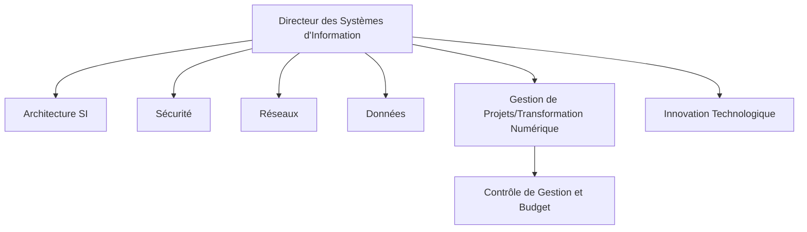
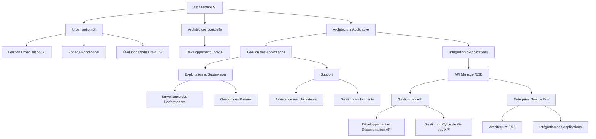
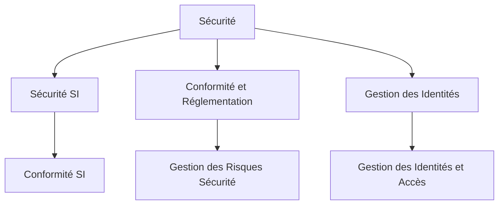
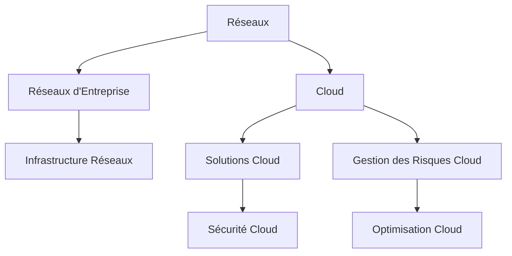
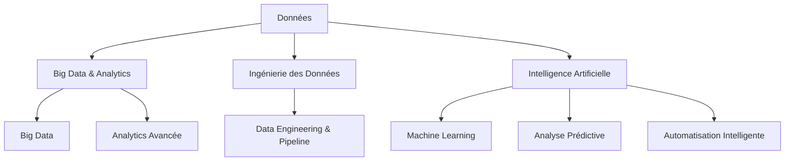
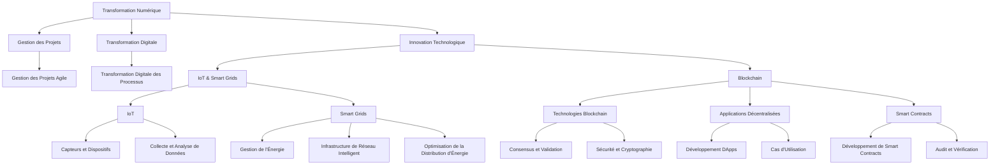

### Introduction à l'Architecture des Systèmes d'Information

Dans le domaine de l'architecture des systèmes d'information (SI), une gestion efficace des applications et leur intégration est essentielle pour assurer une performance optimale et une cohérence globale du système. Les enjeux majeurs incluent le maintien de la qualité du service, la gestion des changements rapides dans les besoins métier, et l'intégration harmonieuse des différentes applications au sein du SI. Pour atteindre ces objectifs, il est crucial d'adopter des stratégies appropriées et de suivre les meilleures pratiques recommandées.

Les objectifs principaux de cette gestion sont :

1. **Optimisation des Performances** : Garantir que les applications répondent aux besoins des utilisateurs de manière rapide et efficace.
2. **Intégration Fluide** : Assurer une intégration sans faille entre les diverses applications et services pour une cohérence du système.
3. **Réduction des Risques** : Minimiser les risques de pannes et d'incidents par une surveillance proactive et des processus de support efficaces.
4. **Gestion des API** : Favoriser une gestion cohérente des interfaces API pour garantir leur disponibilité et leur performance.

Pour atteindre ces objectifs, il est crucial de suivre des stratégies et des bonnes pratiques spécifiques. Ce document propose un aperçu détaillé des pratiques recommandées pour la gestion et l'intégration des applications, en mettant l'accent sur les outils et les processus essentiels. Il inclut des tableaux détaillés sur l'urbanisation du SI, l'architecture logicielle, et l'architecture applicative, offrant une vue d'ensemble des meilleures pratiques pour chaque domaine.

---

### Tableau Détail pour Urbanisation SI

| **Aspect**                | **Exemples**                               | **Outils**                           | **Avantages**                                | **Inconvénients**                           | **Bonnes Pratiques**                                    |
|---------------------------|--------------------------------------------|-------------------------------------|---------------------------------------------|--------------------------------------------|---------------------------------------------------------|
| **Modélisation de l'Urbanisation** | Modèle d'urbanisation d'un SI complexe     | ArchiMate, UML, Enterprise Architect | Permet de visualiser l'organisation et les relations entre les systèmes | Peut être complexe à mettre à jour régulièrement | Utiliser des standards de modélisation reconnus, impliquer les parties prenantes dans la validation |
| **Conception de l'Urbanisation** | Définition des processus métiers et systèmes | TOGAF, Zachman Framework            | Assure une cohérence dans l'alignement des processus et des systèmes | Peut nécessiter des ajustements fréquents en fonction des évolutions | Adopter une approche modulaire, réévaluer régulièrement les besoins métiers |
| **Gouvernance et Management** | Gestion des changements dans l'urbanisation | ITIL, COBIT                         | Permet une meilleure gestion et gouvernance des systèmes d'information | Peut engendrer une lourdeur administrative | Mettre en place des processus de gestion du changement, documenter les modifications |

### Tableau Détail pour Architecture Logicielle

| **Aspect**                | **Exemples**                               | **Outils**                           | **Avantages**                                | **Inconvénients**                           | **Bonnes Pratiques**                                    |
|---------------------------|--------------------------------------------|-------------------------------------|---------------------------------------------|--------------------------------------------|---------------------------------------------------------|
| **Conception Architecturale** | Définition des patterns et des structures logicielles | UML, Design Patterns                 | Facilite la création de systèmes extensibles et maintenables | Peut introduire une complexité accrue si mal géré | Utiliser des modèles de conception éprouvés, valider les architectures avec des prototypes |
| **Évaluation et Optimisation** | Analyse des performances et de la scalabilité | JProfiler, YourKit                   | Permet d'optimiser les performances des systèmes | Peut nécessiter des ajustements fréquents en fonction des charges | Effectuer des revues régulières, intégrer les feedbacks des utilisateurs |
| **Intégration et Interopérabilité** | Gestion des interfaces entre modules logiciels | API Management Tools, Swagger        | Assure la compatibilité entre différentes parties du système | Peut nécessiter des efforts de coordination importants | Définir des standards d'intégration clairs, tester les interfaces de manière exhaustive |

### Tableau Détail pour Architecture Applicative

| **Aspect**                | **Exemples**                               | **Outils**                           | **Avantages**                                | **Inconvénients**                           | **Bonnes Pratiques**                                    |
|---------------------------|--------------------------------------------|-------------------------------------|---------------------------------------------|--------------------------------------------|---------------------------------------------------------|
| **Modélisation Applicative** | Conception des applications et de leurs interactions | ArchiMate, Visio                    | Permet une vue d'ensemble des applications et de leur agencement | Peut être complexe à maintenir à jour | Utiliser des outils de modélisation adaptés, documenter les interactions entre applications |
| **Développement et Déploiement** | Développement d'applications et gestion des versions | Docker, Kubernetes, CI/CD Tools     | Facilite le déploiement continu et l'intégration des applications | Peut nécessiter des compétences techniques spécifiques | Adopter des pratiques DevOps, automatiser les processus de déploiement |
| **Maintenance et Évolution** | Gestion des évolutions et des corrections de bogues | Jira, ServiceNow                      | Permet de gérer efficacement les mises à jour et les correctifs | Peut entraîner une gestion complexe des versions | Mettre en place un système de gestion des changements, planifier les évolutions en fonction des besoins |

---

Ce document vise à fournir des recommandations pratiques pour optimiser la gestion et l'intégration des applications au sein d'une architecture SI, en mettant l'accent sur les meilleures pratiques et les outils essentiels pour chaque domaine.
## Schéma Global Simplifié

------------------

```mermaid
graph TD
    A[Directeur des Systèmes d'Information] --> B[Architecture SI]
    A --> C[Sécurité]
    A --> D[Réseaux]
    A --> F[Données]
    A --> G[Gestion de Projets/Transformation Numérique]
    A --> H[Innovation Technologique]

    %% Architecture SI
    B --> B1[Urbanisation SI]
    B --> B2[Architecture Logicielle]
    B --> B3[Architecture Applicative]
    
    B1 --> B1a[Gestion Urbanisation SI]
    B1 --> B1b[Zonage Fonctionnel]
    B1 --> B1c[Évolution Modulaire du SI]

    B2 --> B2a[Développement Logiciel]

    B3 --> B3a[Gestion des Applications]
    B3 --> B3b[Intégration d'Applications]
    
    B3a --> B3a1[Exploitation et Supervision]
    B3a --> B3a2[Support]
    
    B3a1 --> B3a1a[Surveillance des Performances]
    B3a1 --> B3a1b[Gestion des Pannes]
    
    B3a2 --> B3a2a[Assistance aux Utilisateurs]
    B3a2 --> B3a2b[Gestion des Incidents]
    
    B3b --> H[API Manager/ESB]
    H --> H1[Gestion des API]
    H --> H2[Enterprise Service Bus]
    
    H1 --> H1a[Développement et Documentation API]
    H1 --> H1b[Gestion du Cycle de Vie des API]
    
    H2 --> H2a[Architecture ESB]
    H2 --> H2b[Intégration des Applications]
    
    %% Sécurité
    C --> C1[Sécurité SI]
    C --> C2[Conformité et Réglementation]
    C --> C3[Gestion des Identités]
    
    C1 --> C1a[Conformité SI]
    
    C2 --> C2a[Gestion des Risques Sécurité]
    
    C3 --> C3a[Gestion des Identités et Accès]
    
    %% Réseaux
    D --> D1[Réseaux d'Entreprise]
    D --> E[Cloud]
    
    D1 --> D1a[Infrastructure Réseaux]
    
    E --> E1[Solutions Cloud]
    E --> E2[Gestion des Risques Cloud]
    
    E1 --> E1a[Sécurité Cloud]
    
    E2 --> E2a[Optimisation Cloud]
    
    %% Données
    F --> F1[Big Data & Analytics]
    F --> F2[Ingénierie des Données]
    F --> I[Intelligence Artificielle]
    
    F1 --> F1a[Big Data]
    F1 --> F1b[Analytics Avancée]
    
    F2 --> F2a[Data Engineering & Pipeline]
    
    I --> I1[Machine Learning]
    I --> I2[Analyse Prédictive]
    I --> I3[Automatisation Intelligente]
    
    %% Gestion de Projets/Transformation Numérique
    G --> G1[Gestion des Projets]
    G --> G2[Transformation Digitale]
    G --> I[Contrôle de Gestion et Budget]
    
    G1 --> G1a[Gestion des Projets Agile]
    
    G2 --> G2a[Transformation Digitale des Processus]
    
    %% Innovation Technologique
    H --> H1[IoT & Smart Grids]
    H --> H2[Blockchain]
    
    H1 --> H1a[IoT]
    H1 --> H1b[Smart Grids]
    
    H1a --> H1a1[Capteurs et Dispositifs]
    H1a --> H1a2[Collecte et Analyse de Données]
    
    H1b --> H1b1[Gestion de l'Énergie]
    H1b --> H1b2[Infrastructure de Réseau Intelligent]
    H1b --> H1b3[Optimisation de la Distribution d'Énergie]
    
    H2 --> H2a[Technologies Blockchain]
    H2 --> H2b[Applications Décentralisées]
    H2 --> H2c[Smart Contracts]
    
    H2a --> H2a1[Consensus et Validation]
    H2a --> H2a2[Sécurité et Cryptographie]
    
    H2b --> H2b1[Développement DApps]
    H2b --> H2b2[Cas d'Utilisation]
    
    H2c --> H2c1[Développement de Smart Contracts]
    H2c --> H2c2[Audit et Vérification]
```

------------------------------
---

### 1. Architecture SI

---

#### 1.1 Urbanisation SI

| **Aspect**                | **Exemples**                               | **Outils**                           | **Avantages**                                | **Inconvénients**                           | **Bonnes Pratiques**                                    |
|---------------------------|--------------------------------------------|-------------------------------------|---------------------------------------------|--------------------------------------------|---------------------------------------------------------|
| **Modélisation de l'Urbanisation** | Modèle d'urbanisation d'un SI complexe     | ArchiMate, UML, Enterprise Architect | Permet de visualiser l'organisation et les relations entre les systèmes | Peut être complexe à mettre à jour régulièrement | Utiliser des standards de modélisation reconnus, impliquer les parties prenantes dans la validation |
| **Conception de l'Urbanisation** | Définition des processus métiers et systèmes | TOGAF, Zachman Framework            | Assure une cohérence dans l'alignement des processus et des systèmes | Peut nécessiter des ajustements fréquents en fonction des évolutions | Adopter une approche modulaire, réévaluer régulièrement les besoins métiers |
| **Gouvernance et Management** | Gestion des changements dans l'urbanisation | ITIL, COBIT                         | Permet une meilleure gestion et gouvernance des systèmes d'information | Peut engendrer une lourdeur administrative | Mettre en place des processus de gestion du changement, documenter les modifications |

### 1.2. Architecture Logicielle

| **Aspect**                | **Exemples**                               | **Outils**                           | **Avantages**                                | **Inconvénients**                           | **Bonnes Pratiques**                                    |
|---------------------------|--------------------------------------------|-------------------------------------|---------------------------------------------|--------------------------------------------|---------------------------------------------------------|
| **Conception Architecturale** | Définition des patterns et des structures logicielles | UML, Design Patterns                 | Facilite la création de systèmes extensibles et maintenables | Peut introduire une complexité accrue si mal géré | Utiliser des modèles de conception éprouvés, valider les architectures avec des prototypes |
| **Évaluation et Optimisation** | Analyse des performances et de la scalabilité | JProfiler, YourKit                   | Permet d'optimiser les performances des systèmes | Peut nécessiter des ajustements fréquents en fonction des charges | Effectuer des revues régulières, intégrer les feedbacks des utilisateurs |
| **Intégration et Interopérabilité** | Gestion des interfaces entre modules logiciels | API Management Tools, Swagger        | Assure la compatibilité entre différentes parties du système | Peut nécessiter des efforts de coordination importants | Définir des standards d'intégration clairs, tester les interfaces de manière exhaustive |

### 1.3. Architecture Applicative

| **Aspect**                | **Exemples**                               | **Outils**                           | **Avantages**                                | **Inconvénients**                           | **Bonnes Pratiques**                                    |
|---------------------------|--------------------------------------------|-------------------------------------|---------------------------------------------|--------------------------------------------|---------------------------------------------------------|
| **Modélisation Applicative** | Conception des applications et de leurs interactions | ArchiMate, Visio                    | Permet une vue d'ensemble des applications et de leur agencement | Peut être complexe à maintenir à jour | Utiliser des outils de modélisation adaptés, documenter les interactions entre applications |
| **Développement et Déploiement** | Développement d'applications et gestion des versions | Docker, Kubernetes, CI/CD Tools     | Facilite le déploiement continu et l'intégration des applications | Peut nécessiter des compétences techniques spécifiques | Adopter des pratiques DevOps, automatiser les processus de déploiement |
| **Maintenance et Évolution** | Gestion des évolutions et des corrections de bogues | Jira, ServiceNow                      | Permet de gérer efficacement les mises à jour et les correctifs | Peut entraîner une gestion complexe des versions | Mettre en place un système de gestion des changements, planifier les évolutions en fonction des besoins |

---

Ces tableaux détaillent les aspects clés de chaque sous-catégorie de l'architecture des systèmes d'information, fournissant des informations pratiques, des outils recommandés, des avantages, des inconvénients, et des bonnes pratiques pour chaque domaine. Ajustez les détails en fonction des spécificités de votre organisation ou de votre projet.

-----------------------------------
--------------------------------
## 2. Sécurité

| **Aspect**           | **Exemples**                          | **Outils**                          | **Avantages**                              | **Inconvénients**                           | **Bonnes Pratiques**                                    |
|----------------------|---------------------------------------|------------------------------------|-------------------------------------------|--------------------------------------------|---------------------------------------------------------|
| **Gestion des Risques** | Identification et évaluation des risques | Nessus, Qualys                    | Réduit les risques de sécurité, améliore la résilience | Peut être coûteux et complexe à mettre en œuvre | Effectuer des analyses de risques régulières, maintenir des politiques de sécurité à jour |
| **Protection des Données** | Cryptage des données sensibles      | VeraCrypt, BitLocker               | Protège les données contre les accès non autorisés | Peut affecter les performances du système | Utiliser des algorithmes de cryptage robustes, gérer les clés de manière sécurisée |
| **Réponse aux Incidents** | Gestion des incidents de sécurité     | SIEM (Splunk, ELK)                 | Permet une réaction rapide aux incidents de sécurité | Peut générer un volume élevé d'alertes à analyser | Établir des procédures claires de réponse aux incidents, former les équipes à la gestion des incidents |

-----------------------------------------
## 3. Réseaux

| **Aspect**           | **Exemples**                           | **Outils**                          | **Avantages**                               | **Inconvénients**                           | **Bonnes Pratiques**                                    |
|----------------------|----------------------------------------|------------------------------------|--------------------------------------------|--------------------------------------------|---------------------------------------------------------|
| **Conception du Réseau** | Architecture des réseaux locaux et étendus | Cisco Packet Tracer, GNS3          | Assure une connectivité efficace et sécurisée | Peut être complexe à concevoir pour des environnements vastes | Planifier la topologie du réseau en fonction des besoins, utiliser des outils de simulation |
| **Gestion du Réseau** | Surveillance et gestion des performances | Nagios, PRTG Network Monitor        | Permet de détecter et résoudre les problèmes rapidement | Peut nécessiter une surveillance constante | Configurer des alertes pour les anomalies, effectuer une maintenance préventive |
| **Sécurité du Réseau** | Protection contre les attaques réseau  | Firewall, IDS/IPS (Snort)           | Protège le réseau contre les menaces externes | Peut introduire des latences ou des points de défaillance | Mettre en place des politiques de sécurité réseau, utiliser des systèmes de détection d'intrusion |

-----------------------------------------------
## 4. Données

| **Aspect**           | **Exemples**                           | **Outils**                          | **Avantages**                               | **Inconvénients**                           | **Bonnes Pratiques**                                    |
|----------------------|----------------------------------------|------------------------------------|--------------------------------------------|--------------------------------------------|---------------------------------------------------------|
| **Gestion des Données** | Administration des bases de données   | SQL Server, Oracle, MySQL          | Assure l'intégrité et la disponibilité des données | Peut être coûteux en termes de ressources | Mettre en œuvre des stratégies de sauvegarde et de restauration, optimiser les performances des bases de données |
| **Analyse des Données** | Traitement et analyse des données     | Tableau, Power BI, Hadoop          | Fournit des insights précieux pour la prise de décision | Peut nécessiter une expertise en analyse de données | Utiliser des outils d'analyse appropriés, garantir la qualité des données |
| **Gouvernance des Données** | Conformité et gestion de la qualité des données | Data Governance Tools (Collibra)  | Assure la conformité réglementaire et la qualité des données | Peut introduire des processus supplémentaires | Définir des politiques de gouvernance claires, effectuer des audits réguliers |

----------------------------------

## 5. Transformation Numérique

| **Aspect**           | **Exemples**                           | **Outils**                          | **Avantages**                              | **Inconvénients**                           | **Bonnes Pratiques**                                    |
|----------------------|----------------------------------------|------------------------------------|-------------------------------------------|--------------------------------------------|---------------------------------------------------------|
| **Stratégie de Transformation** | Mise en œuvre de nouvelles technologies | Digital Transformation Platforms   | Améliore l'efficacité et l'agilité de l'entreprise | Peut rencontrer une résistance au changement | Développer une feuille de route claire, impliquer les parties prenantes |
| **Adoption des Technologies** | Intégration de l'IA, IoT, Cloud        | AWS, Azure, Google Cloud            | Offre des opportunités d'innovation, améliore les capacités opérationnelles | Peut nécessiter des investissements importants | Choisir des technologies adaptées aux besoins, former le personnel aux nouvelles compétences |
| **Changement Organisationnel** | Gestion du changement et formation      | Change Management Tools (Prosci)   | Facilite la transition vers des modèles opérationnels numériques | Peut nécessiter une gestion active des ressources humaines | Communiquer clairement les objectifs, fournir un soutien et une formation adéquate |

---------------------------------------------

## 6. Innovation Technologique

| **Aspect**           | **Exemples**                           | **Outils**                          | **Avantages**                               | **Inconvénients**                           | **Bonnes Pratiques**                                    |
|----------------------|----------------------------------------|------------------------------------|--------------------------------------------|--------------------------------------------|---------------------------------------------------------|
| **Veille Technologique** | Surveillance des tendances émergentes | TechCrunch, Gartner, Forrester      | Permet de rester à la pointe de la technologie | Peut être difficile de filtrer les informations pertinentes | Suivre les rapports de recherche, participer à des conférences et événements |
| **Recherche et Développement** | Développement de nouveaux produits et services | IDEs, Outils de prototypage          | Stimule l'innovation, crée des avantages concurrentiels | Peut être coûteux et risqué | Allouer des ressources dédiées à R&D, tester les prototypes auprès des utilisateurs finaux |
| **Gestion des Projets Innovants** | Gestion de projets de recherche et d'innovation | Jira, Trello, Asana                 | Permet une gestion efficace des projets innovants | Peut nécessiter une expertise en gestion de projets | Définir des objectifs clairs, suivre les progrès régulièrement |

---

Ces tableaux détaillés offrent une vue complète des différents aspects de la gestion des systèmes d'information, fournissant des informations pratiques et des recommandations pour chaque domaine clé. N'hésitez pas à ajuster les exemples, outils, avantages, inconvénients et bonnes pratiques en fonction des besoins spécifiques de votre organisation ou de votre projet.
------------------

### Détails Supplémentaires - Architecture SI

---

### Détails du Schéma

#### **1. Urbanisation SI**
   - **Gestion Urbanisation SI :** Planification et organisation du système d'information pour optimiser son architecture.
   - **Zonage Fonctionnel :** Définition des zones fonctionnelles pour améliorer la modularité.
   - **Évolution Modulaire du SI :** Gestion de l'évolution des modules pour répondre aux besoins changeants.

#### **2. Architecture Logicielle**
   - **Développement Logiciel :** Pratiques et outils pour concevoir, coder et tester des applications logicielles.

#### **3. Architecture Applicative**
   - **Gestion des Applications :** Administration complète des applications informatiques.
     - **Exploitation et Supervision :**
       - **Surveillance des Performances :** Suivi des performances des applications pour assurer leur bon fonctionnement.
       - **Gestion des Pannes :** Réponse rapide aux problèmes pour minimiser les interruptions de service.
     - **Support :**
       - **Assistance aux Utilisateurs :** Aide aux utilisateurs finaux pour résoudre les problèmes d'utilisation.
       - **Gestion des Incidents :** Suivi et résolution des incidents pour maintenir la qualité du service.
   - **Intégration d'Applications :**
     - **API Manager/ESB :**
       - **Gestion des API :** Administration des API pour assurer leur bon fonctionnement et leur intégration.
         - **Développement et Documentation API :** Création et documentation des API pour une intégration efficace.
         - **Gestion du Cycle de Vie des API :** Suivi et mise à jour des API tout au long de leur cycle de vie.
       - **Enterprise Service Bus :** Facilitation de l'intégration entre les différentes applications.
         - **Architecture ESB :** Conception de l'architecture du bus de services pour l'intégration.
         - **Intégration des Applications :** Connexion et orchestration des applications via le bus de services.

Ce schéma simplifié permet de visualiser clairement la structure de l'Architecture SI en mettant en évidence les principaux aspects de la gestion des applications, avec un focus particulier sur l'intégration et l'exploitation.

### Explications des Modifications :

1. **Gestion des Applications** et **Intégration d'Applications** sont maintenant regroupés sous **Architecture Applicative** pour éviter les doublons.
2. **API Manager/ESB** a été déplacé sous **Intégration d'Applications**, ce qui simplifie l'organisation et la hiérarchie des composants.
3. Les détails sur la gestion des API et l'Enterprise Service Bus sont inclus dans le sous-bloc **Intégration d'Applications**, consolidant ainsi les éléments associés.

### Détails Supplémentaires - Gestion des Applications

La **Gestion des Applications** est une discipline cruciale dans l'architecture des systèmes d'information. Elle couvre l'ensemble des pratiques et outils nécessaires pour gérer efficacement les applications au cours de leur cycle de vie, depuis le développement initial jusqu'à leur déploiement, maintenance, et mise hors service. Voici un aperçu détaillé de la Gestion des Applications, y compris ses outils, bonnes pratiques, et processus associés.

---

#### **Définition**

La Gestion des Applications englobe l'administration, le déploiement, la maintenance, et l'optimisation des applications informatiques. Cela inclut la coordination des ressources nécessaires pour assurer le bon fonctionnement des applications, l'amélioration continue de leurs performances, et leur alignement avec les besoins métier.

---

#### **Composantes Clés**

1. **Développement et Déploiement**
   - **Développement Logiciel :** Conception, codage, et test des applications en utilisant des méthodologies et des outils adaptés pour assurer la qualité et la performance.
   - **Déploiement :** Processus d'installation des applications dans des environnements de production, y compris la configuration et la validation.

2. **Maintenance et Support**
   - **Maintenance :** Gestion des mises à jour, des correctifs, et des améliorations pour assurer la continuité du service et la sécurité des applications.
   - **Support :** Assistance aux utilisateurs pour résoudre les problèmes et répondre aux demandes concernant les applications.

3. **Surveillance et Optimisation**
   - **Surveillance :** Suivi des performances des applications pour détecter et résoudre les problèmes potentiels avant qu'ils n'affectent les utilisateurs.
   - **Optimisation :** Amélioration des performances et de l'efficacité des applications en ajustant les configurations et en mettant en œuvre des améliorations.

4. **Intégration d'Applications**
   - **API Manager/ESB :** Outils et pratiques pour connecter les différentes applications, faciliter les échanges de données, et garantir l'interopérabilité.

---

#### **Outils de Gestion des Applications**

1. **Outils de Développement**
   - **IDE (Integrated Development Environment) :** Environnements de développement intégrés pour coder et tester les applications. Exemple : **Visual Studio**, **IntelliJ IDEA**.
   - **Systèmes de Gestion de Versions (VCS) :** Outils pour gérer les versions du code source. Exemple : **Git**, **Subversion (SVN)**.

2. **Outils de Déploiement**
   - **CI/CD (Continuous Integration/Continuous Deployment) :** Outils pour automatiser le processus de construction, de test, et de déploiement des applications. Exemple : **Jenkins**, **GitLab CI**, **CircleCI**.
   - **Outils de Conteneurisation :** Technologies pour empaqueter les applications et leurs dépendances dans des conteneurs. Exemple : **Docker**, **Kubernetes**.

3. **Outils de Maintenance et Support**
   - **Systèmes de Gestion des Tickets :** Outils pour suivre et gérer les demandes et les incidents. Exemple : **Jira**, **ServiceNow**.
   - **Outils de Gestion des Pannes :** Outils pour surveiller et résoudre les problèmes de performance. Exemple : **Nagios**, **Datadog**.

4. **Outils de Surveillance et Optimisation**
   - **Outils de Surveillance des Performances :** Outils pour surveiller la performance des applications en temps réel. Exemple : **New Relic**, **AppDynamics**.
   - **Outils d'Analyse des Logs :** Outils pour analyser les journaux d'application et détecter les anomalies. Exemple : **ELK Stack (Elasticsearch, Logstash, Kibana)**.

5. **Intégration d'Applications**
   - **API Manager :** Outils pour gérer les API, contrôler l'accès, et surveiller leur utilisation. Exemple : **Apigee**, **Kong**.
   - **ESB (Enterprise Service Bus) :** Outils pour orchestrer les échanges de données entre les applications. Exemple : **WSO2 ESB**, **MuleSoft Anypoint Platform**.

---

#### **Bonnes Pratiques**

1. **Adopter des Méthodologies Agiles :**
   - Utiliser des approches agiles comme **Scrum** ou **Kanban** pour améliorer la flexibilité et la réactivité du développement et de la gestion des applications.

2. **Automatiser les Tests et le Déploiement :**
   - Mettre en place des processus d'intégration continue et de déploiement continu (CI/CD) pour automatiser les tests et les déploiements, réduisant ainsi les erreurs humaines et accélérant le cycle de livraison.

3. **Mettre en Place une Surveillance Proactive :**
   - Utiliser des outils de surveillance pour suivre les performances des applications et détecter les problèmes avant qu'ils n'affectent les utilisateurs.

4. **Documenter les Processus et les APIs :**
   - Maintenir une documentation claire et à jour des processus de développement, des API, et des configurations pour faciliter la gestion et la maintenance des applications.

5. **Gérer les Versions et les Dépendances :**
   - Utiliser des systèmes de gestion de versions et des outils pour gérer les dépendances des applications afin de garantir la cohérence et la qualité des déploiements.

6. **Assurer la Sécurité des Applications :**
   - Intégrer des pratiques de sécurité dès le développement (DevSecOps) et effectuer des audits réguliers pour identifier et corriger les vulnérabilités.

---

En intégrant ces pratiques et en utilisant les outils appropriés, la gestion des applications devient plus efficace et mieux alignée avec les objectifs métiers, tout en assurant une meilleure qualité et une gestion optimale des ressources informatiques.
### Détails Supplémentaires - Sécurité

### Détails Supplémentaires - Réseaux et Cloud

### Détails Supplémentaires - Données et Intelligence Artificielle

### Détails Supplémentaires - Transformation Numérique et Innovation Technologique

Ce schéma simplifié regroupe les éléments principaux sous **Architecture SI**, tout en conservant les sous-éléments comme **API Manager/ESB** et **Gestion des Applications**. Les autres domaines sont structurés pour refléter leur relation avec l'architecture et les spécificités fonctionnelles.

-----------------------------------------------
----------------------------------------------------------------------
# Schéma d’Architecture du Système d’Information

Ce schéma d'architecture représente une structure typique du **système d'information** (SI) d'une entreprise, où chaque composante est responsable de domaines spécifiques tels que l'architecture, la sécurité, les réseaux, les données, le cloud et la transformation numérique. Dans le cadre d’une banque, toutes ces composantes doivent interagir harmonieusement pour assurer la continuité et la sécurité des services bancaires.

----------

### Explications détaillées et exemples

#### 1. **Architecture et Urbanisation SI**

- **Urbanisation SI** : 
  - **Concept** : La structuration du Système d'Information (SI) en **zones fonctionnelles** distinctes pour optimiser la gestion et la flexibilité du SI. Cette approche permet de séparer les différentes activités et processus du SI, facilitant ainsi leur évolution et maintenance.
  - **Exemple Pratique** : Une banque peut diviser son SI en **zones** telles que la **zone de paiement**, la **zone de gestion des crédits**, et la **zone de conformité**. Cette séparation permet de mettre à jour ou d’améliorer chaque zone indépendamment sans affecter les autres parties du système.

- **Architecture Logicielle** : 
  - **Concept** : Organisation des logiciels en **microservices** pour garantir une modularité accrue, facilitant ainsi le déploiement, la maintenance, et l’évolutivité des services.
  - **Exemple Pratique** : Un service de **gestion des prêts** est conçu comme un microservice autonome. Cela permet au service de gestion des prêts de fonctionner indépendamment d'autres services comme ceux des **virements bancaires** ou de la **consultation des soldes**.

- **Architecture Applicative** :
  - **Concept** : Intégration fluide des applications en combinant les **systèmes legacy** avec des **services modernes** via des **API** ou des **middleware**.
  - **Exemple Pratique** : Une application bancaire mobile accède aux systèmes legacy à travers des **API REST** pour obtenir des informations en temps réel sur les transactions.

#### 2. **Sécurité**

- **Sécurité SI** :
  - **Concept** : Mise en œuvre de politiques de sécurité pour protéger les **données sensibles** des clients et assurer la résilience contre les cyberattaques.
  - **Exemple Pratique** : Utilisation de **firewalls**, **systèmes de détection et de prévention des intrusions (IDS/IPS)**, et respect des normes de sécurité comme **ISO/IEC 27001** pour sécuriser l'infrastructure bancaire.

- **Conformité et Réglementation** :
  - **Concept** : Adhésion à des régulations spécifiques pour assurer la protection des données et la gestion des risques financiers.
  - **Exemple Pratique** : Application du **Règlement Général sur la Protection des Données (RGPD)** pour garantir la confidentialité des informations personnelles des clients et le respect des exigences en matière de reporting et de sécurité.

- **Gestion des Identités (IAM)** :
  - **Concept** : Mise en place de solutions pour la gestion des accès et des authentifications afin de contrôler et sécuriser l'accès aux ressources internes.
  - **Exemple Pratique** : Utilisation de **Keycloak** pour gérer les authentifications et les autorisations des employés, assurant que seuls les utilisateurs autorisés ont accès aux systèmes critiques.

#### 3. **Réseaux**

- **Réseaux d'Entreprise** :
  - **Concept** : Gestion des **réseaux internes** pour assurer des échanges sécurisés et efficaces entre les différentes agences et les datacenters.
  - **Exemple Pratique** : Mise en place de **VPN** ou de **MPLS** pour sécuriser les communications entre les différentes succursales d'une banque, garantissant ainsi la confidentialité et l'intégrité des données échangées.

#### 4. **Cloud**

- **Solutions Cloud** :
  - **Concept** : Adoption de services cloud pour améliorer la **scalabilité** et la **disponibilité** des services bancaires.
  - **Exemple Pratique** : Hébergement de la plateforme de **paiement en ligne** sur des services cloud comme **AWS** ou **Microsoft Azure** pour bénéficier d’une gestion centralisée, d'une disponibilité mondiale, et de sauvegardes automatisées.

- **Gestion des Risques Cloud** :
  - **Concept** : Mise en place de stratégies de sécurité pour protéger les environnements cloud et surveiller les configurations.
  - **Exemple Pratique** : Utilisation d'outils comme **Cloud Security Posture Management (CSPM)** pour suivre les vulnérabilités, gérer les configurations et garantir la conformité des politiques de sécurité dans le cloud.

#### 5. **Données**

- **Big Data & Analytics** :
  - **Concept** : Exploitation des **données massives** pour offrir des services personnalisés et améliorer les stratégies commerciales.
  - **Exemple Pratique** : Analyse des **transactions** des clients en utilisant des outils comme **Hadoop** ou **Spark** pour identifier des opportunités de crédit et proposer des offres ciblées.

- **Ingénierie des Données** :
  - **Concept** : Création de **pipelines de données** robustes pour assurer la collecte et le traitement des données en temps réel.
  - **Exemple Pratique** : Utilisation de **Apache Kafka** pour gérer les flux de données entre les systèmes de gestion des comptes et les services analytiques, permettant un traitement en temps réel des données transactionnelles.

#### 6. **Transformation Numérique**

- **Gestion de Projets** :
  - **Concept** : Application des méthodes **Agile** ou **Scrum** pour organiser la transformation numérique avec des itérations rapides et des améliorations continues.
  - **Exemple Pratique** : Mise en œuvre de **sprints** pour développer et déployer progressivement de nouvelles fonctionnalités sur une plateforme de gestion des comptes clients.

- **Transformation Digitale** :
  - **Concept** : Numérisation des processus bancaires traditionnels pour améliorer l'efficacité et l'expérience client.
  - **Exemple Pratique** : Développement d'une **plateforme en ligne** permettant aux clients de faire des demandes de crédit ou d'ouvrir des comptes sans avoir à se rendre en agence.

- **Innovation Technologique** :
  - **Concept** : Intégration de technologies avancées comme l'**IA** ou la **blockchain** pour améliorer la gestion des risques et des transactions.
  - **Exemple Pratique** : Utilisation de **l'IA** pour détecter des transactions suspectes et prévenir les fraudes bancaires en temps réel.

### Tableau de Synthèse des 6 Axes

| **Axe**                         | **Concepts Clés**                                   | **Exemples Pratiques** |
|----------------------------------|-----------------------------------------------------|------------------------|
| **Architecture et Urbanisation** | Urbanisation SI, Architecture Logicielle, Applicative | Zones fonctionnelles (crédits, paiements), microservices pour la gestion des prêts, intégration via API REST |
| **Sécurité**                     | Sécurité SI, Conformité, Gestion des Identités        | ISO/IEC 27001, RGPD, Keycloak pour IAM |
| **Réseaux**                      | Réseaux d'Entreprise, VPN, MPLS                      | VPN sécurisé pour agences, MPLS pour connexions inter-agences |
| **Cloud**                        | Solutions Cloud, Gestion des Risques Cloud           | Cloud pour services bancaires, CSPM pour la gestion des risques |
| **Données**                      | Big Data & Analytics, Ingénierie des Données         | Hadoop pour analyse des transactions, Kafka pour pipelines de données |
| **Transformation Numérique**     | Gestion de Projets Agile, Numérisation, Innovation   | Sprints pour développement de fonctionnalités, plateforme en ligne pour demandes de crédit, IA pour détection de fraudes |

### Conclusion

L'architecture et l'urbanisation du Système d'Information (SI) permettent aux banques de gérer de manière **modulaire**, **sécurisée**, et **scalable** leurs services. L'adoption de normes telles que **TOGAF** pour l'architecture et l'utilisation d'outils comme **Sparx** pour la modélisation facilitent la modernisation progressive du SI tout en maintenant l'intégration avec les systèmes legacy. L'intégration des solutions cloud, des technologies de données avancées, et des approches de transformation numérique renforce la résilience et l'agilité des banques dans un environnement en constante évolution.

---

### 1. **Directeur des Systèmes d'Information (DSI)**
Le **DSI** est chargé de la gouvernance de l'IT. Il supervise la stratégie informatique, la mise en place des infrastructures technologiques, et la sécurité des systèmes critiques.

#### Exemple dans une banque :
- Le DSI s'assure que le **système de gestion des comptes bancaires** répond aux exigences de **performance**, de **scalabilité** et de **sécurité** pour garantir le bon fonctionnement des services de paiements en ligne.

#### Normes et bonnes pratiques :
- **ISO/IEC 38500** pour la gouvernance informatique.
- **ITIL** (Information Technology Infrastructure Library) pour la gestion des services informatiques.

---
### 2. **Architecture** et **Urbanisation du Système d’Information (SI)**

L'**architecture** dans le cadre d'un système d'information bancaire englobe la **conception globale des systèmes** et des infrastructures informatiques, en veillant à l'intégration efficace des composants logiciels, des applications, et des infrastructures. L'urbanisation du SI, qui consiste à structurer le SI de manière modulaire et flexible, est une composante essentielle pour garantir son évolutivité et sa cohérence.

#### 2.1 **Architecture Logicielle**
L'**architecture logicielle** définit l'organisation des composants logiciels et la manière dont ils interagissent pour fournir des services aux utilisateurs finaux. Dans une banque, cela implique la structuration des modules en microservices, permettant la scalabilité et l'agilité dans le développement et la maintenance.

#### Exemple dans une banque :
- L'architecture logicielle d’une banque comprend des systèmes de **gestion des comptes**, de **paiements en ligne**, de **crédit**, et de **conformité**. Ces systèmes sont modulaires, indépendants, et déployés sous forme de microservices pour permettre des mises à jour et des évolutions sans interrompre les autres services.
  
#### Bonnes pratiques :
- **Architecture orientée services (SOA)** : Une banque pourrait adopter une architecture SOA pour assurer une communication fluide entre les différents systèmes bancaires, notamment les **systèmes de paiement**, **de prêt** et **de gestion des comptes**.
  
#### Outils et Méthodes :
- **Sparx Enterprise Architect**, **Archi** pour la modélisation des architectures.
- **TOGAF (The Open Group Architecture Framework)** pour structurer et gérer l'architecture d'entreprise de manière cohérente.

#### 2.2 **Architecture des Applications**
L'**architecture des applications** se concentre sur la manière dont les applications interagissent avec les autres systèmes et services dans l'écosystème du SI. Les applications doivent être conçues pour faciliter l'intégration avec les **systèmes legacy** (anciens systèmes), tout en profitant des nouvelles technologies basées sur le **cloud**.

#### Exemple dans une banque :
- L'**application mobile bancaire** doit pouvoir interagir à la fois avec des systèmes legacy (par exemple, le **mainframe** de gestion des comptes clients) et des services modernes hébergés dans le cloud, tels que les services de **paiement instantané**.

#### Bonnes pratiques :
- **API First** : Mettre en place une approche **API-centric** pour favoriser l’interaction entre les nouvelles applications et les systèmes existants.
- Utilisation des **API RESTful** pour connecter les services de back-end aux applications front-end (mobile et web).

#### Outils :
- **API Gateway** comme **WSO2** ou **Kong** pour gérer et sécuriser les échanges entre les applications et les microservices.

---

### 2.3 **Urbanisation du Système d'Information**
L'**urbanisation du SI** consiste à organiser et segmenter le système d'information en différentes zones (ou domaines) pour assurer une évolutivité et une gestion plus efficace. Chaque domaine est dédié à une fonction spécifique, comme les **transactions bancaires**, la **gestion des clients**, ou la **conformité**.

#### Exemple dans une banque :
- Un système d'information bancaire bien urbanisé pourrait avoir une zone dédiée aux **paiements électroniques**, une autre pour la **gestion des crédits**, et une troisième pour les **transactions boursières**, chacune interagissant via des **interfaces standardisées**.

#### Bonnes pratiques :
- **Zonage** : Séparer les différents processus en **zones fonctionnelles** (ex. : zone de transaction, zone de conformité) pour faciliter la gestion et l'évolution du système.

---

### Conclusion sur l'Architecture et l'Urbanisation SI
L'architecture et l'urbanisation du SI permettent d'assurer la **modularité**, la **scalabilité**, et l'**interopérabilité** des différents composants du système d'information d'une banque. L'intégration des **systèmes legacy** avec les nouvelles applications basées sur le **cloud** permet de maintenir la continuité des services tout en modernisant progressivement l'infrastructure. L'adoption de cadres d'architecture comme **TOGAF** et l'utilisation d'outils de modélisation comme **Sparx Enterprise Architect** facilitent cette gestion complexe.

---

---
### 3. **Sécurité**
La sécurité dans un SI bancaire est un pilier fondamental qui couvre la protection des données, la conformité aux régulations, et la gestion des risques.

#### Exemple dans une banque :
- La banque doit protéger les données sensibles des clients en mettant en place des systèmes de **cryptage** (par exemple, **AES-256**) pour les transactions en ligne.
- Mise en place d'un **SIEM** (Security Information and Event Management) pour analyser les événements de sécurité en temps réel et détecter les menaces.

#### Normes :
- **ISO/IEC 27001** : Système de management de la sécurité de l'information.
- **PCI DSS** : Norme pour la sécurité des paiements par carte.

#### Outils :
- **Splunk** pour la surveillance de la sécurité.
- **Fortinet** pour les pare-feu et la gestion des menaces.

---

### 4. **Réseaux**
Les réseaux assurent la connectivité entre les différents composants du SI, garantissant un échange sécurisé des données entre agences, centres de données et systèmes de paiement.

#### Exemple dans une banque :
- Les agences bancaires sont connectées via des réseaux **VPN** pour permettre la transmission sécurisée des données entre les agences locales et le centre de données principal.

#### Bonnes pratiques :
- Utiliser une segmentation des réseaux pour isoler les systèmes critiques (par exemple, les transactions financières) des autres systèmes moins sensibles.
  
#### Outils :
- **Cisco Meraki** pour la gestion des réseaux et la sécurité des connexions.
  
---

### 5. **Cloud**
Les solutions **cloud** offrent de la flexibilité pour héberger des applications bancaires critiques, permettant une gestion évolutive des ressources.

#### Exemple dans une banque :
- La banque peut déployer une partie de son infrastructure dans le **cloud hybride**, par exemple pour héberger un **Data Lake** permettant d'analyser les transactions des clients pour détecter des comportements anormaux.
  
#### Normes :
- **ISO/IEC 17788** sur les définitions et concepts du cloud.
  
#### Outils :
- **AWS**, **Microsoft Azure** pour héberger des services critiques.

#### Bonnes pratiques :
- Mise en place de **Redundancy** (redondance) dans le cloud pour garantir la haute disponibilité des services bancaires, même en cas de panne d'un centre de données.

---

### 6. **Données**
Les données constituent le cœur d'une banque. Elles doivent être stockées, analysées et protégées pour fournir des informations précises sur les clients et améliorer les services bancaires.

#### Exemple dans une banque :
- Utilisation de l'**intelligence artificielle (IA)** pour analyser les données des clients, détecter des fraudes ou offrir des recommandations personnalisées pour les investissements.
  
#### Normes :
- **GDPR** (Règlement général sur la protection des données) pour assurer la confidentialité des données des clients.

#### Outils :
- **Apache Hadoop** pour le traitement des **Big Data**.
- **Tableau** pour l'analyse des données et les tableaux de bord interactifs.

#### Bonnes pratiques :
- Mettre en place une **gouvernance des données** claire et des procédures de **nettoyage de données** pour garantir leur qualité.

---

### 7. **Transformation Numérique**
La transformation numérique consiste à exploiter les technologies modernes pour améliorer les processus internes, l'innovation, et l'expérience client.

#### Exemple dans une banque :
- Développement d'une application mobile utilisant la **blockchain** pour permettre des paiements internationaux instantanés et sécurisés.

#### Outils :
- **DevOps** pour accélérer la mise en production des nouvelles fonctionnalités.
- **JIRA** pour la gestion des projets numériques.
  
---

## Exemple end-to-end : Système d'information d'une banque

### **Cas pratique : Gestion des comptes bancaires et paiements en ligne**
1. **Architecture Logicielle** : La banque utilise une **architecture microservices** pour décomposer ses services. Les modules indépendants (gestion des comptes, paiements, gestion des prêts) interagissent via des **API REST**. Chaque module est déployé dans un environnement **Kubernetes** pour garantir une évolutivité rapide et une résilience accrue.
   
2. **Architecture des Applications** : Les applications bancaires (web et mobile) interagissent avec les microservices via des **API Gateway**. Le front-end est développé avec **React** pour une interface utilisateur réactive, tandis que le back-end est structuré avec des services REST.
   
3. **Sécurité** : Toutes les transactions sont chiffrées avec **TLS** et signées numériquement. Les utilisateurs doivent s'authentifier avec un **MFA (Multi-Factor Authentication)** pour accéder à leurs comptes. Les logs de sécurité sont centralisés dans un **SIEM** pour une détection rapide des incidents.
   
4. **Réseaux** : Les agences locales sont connectées au siège par des **réseaux privés virtuels (VPN)**. Les transferts de données sensibles sont protégés par des tunnels chiffrés.
   
5. **Cloud** : Les services sont hébergés dans un **cloud hybride**, avec une partie des données critiques conservée en interne pour des raisons de conformité (comme le demande la régulation locale), tandis que les services non sensibles sont sur **AWS**.
   
6. **Données** : Les transactions sont stockées dans une **base de données relationnelle** pour les opérations quotidiennes, tandis que les données historiques sont transférées dans un **Data Lake** pour être analysées avec **Spark** et **Hadoop** afin d'identifier les tendances et comportements clients.
   
7. **Transformation Numérique** : La banque lance régulièrement de nouveaux services via une équipe **DevOps** qui utilise des pipelines d'intégration continue et de déploiement continu (CI/CD) pour assurer des mises à jour fréquentes et sécurisées.

---

### Conclusion
En combinant une **architecture logicielle modulaire**, une **architecture d'application orientée services

** avec une forte intégration des composants cloud, sécurité et réseau, une banque peut créer un **système d'information résilient**, capable de répondre aux besoins des clients tout en restant sécurisé et scalable.
