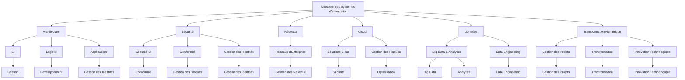

# **Top 25 des Métiers d'Architectes dans une Direction des Systèmes d'Information**

#### **Introduction**

Les Architectes jouent un rôle crucial au sein des Directions des Systèmes d'Information (DSI), en s'assurant que les systèmes informatiques sont conçus, intégrés et gérés de manière optimale pour répondre aux besoins de l'entreprise. Avec l'évolution rapide des technologies et des méthodes, les rôles des Architectes se diversifient et se spécialisent pour couvrir un large éventail de domaines critiques. Ce document présente un aperçu des 25 principaux métiers d'architectes dans une DSI, en détaillant leurs compétences clés, certifications recommandées, projets typiques et une roadmap pour atteindre l'expertise dans chaque domaine.

---
### **Top 25 des Métiers d'Architectes dans une Direction des Systèmes d'Information**

| **Métiers d'Architectes**                           | **Compétences Clés**                                                                                                                       | **Certifications Recommandées**                                  | **Projets Recommandés**                                       | **Roadmap**                                                                                                                                                                          |
|-----------------------------------------------------|---------------------------------------------------------------------------------------------------------------------------------------------|------------------------------------------------------------------|--------------------------------------------------------------|---------------------------------------------------------------------------------------------------------------------------------------------------------------------------------------|
| **1. Architecte SI**                              | Gestion de projets, conception d'architecture, intégration de systèmes, sécurité, gestion des données.                                      | TOGAF, Zachman, ITIL                                               | Refonte d'architecture SI, intégration de systèmes complexes. | Acquérir des connaissances en gestion de projets et conception SI. Obtenir des certifications TOGAF ou Zachman. Réaliser des projets d'intégration complexe.                       |
| **2. Architecte Logiciel**                        | Conception de logiciels, développement, optimisation, gestion de la qualité, intégration des systèmes.                                      | Certified Software Development Professional (CSDP)                | Développement d'une plateforme SaaS, optimisation d'algorithmes. | Étudier la conception de logiciels et l'optimisation. Obtenir la certification CSDP. Développer des projets de plateforme SaaS.                                                    |
| **3. Architecte Sécurité des Systèmes d'Information** | Gestion des risques, sécurité des réseaux, sécurité des applications, réponse aux incidents, conformité réglementaire.                      | CISSP, CEH, CSSLP                                                | Mise en place d'un système de sécurité complet, gestion d'incidents de sécurité. | Étudier la gestion des risques et la sécurité des systèmes. Obtenir les certifications CISSP ou CEH. Réaliser des projets de mise en place de systèmes de sécurité.                 |
| **4. Architecte Réseaux**                         | Conception de réseaux, gestion des réseaux, sécurité des réseaux, optimisation des performances, virtualisation des réseaux.                | CCNA, CCNP, CWNE                                                 | Conception et déploiement d'architectures réseau complexes. | Étudier la conception et la gestion des réseaux. Obtenir les certifications CCNA ou CCNP. Réaliser des projets de déploiement d'architectures réseau.                              |
| **5. Architecte Cloud**                          | Conception et déploiement de solutions cloud, gestion des coûts cloud, sécurité cloud, optimisation des performances cloud.                 | AWS Certified Solutions Architect, Google Cloud Professional Architect | Déploiement d'une solution cloud multi-cloud, optimisation des coûts cloud. | Étudier la conception et la gestion des solutions cloud. Obtenir des certifications AWS ou Google Cloud. Réaliser des projets de déploiement et optimisation des solutions cloud.     |
| **6. Architecte Big Data**                       | Conception de systèmes de gestion de données volumineuses, optimisation des performances, sécurité des données, gestion des flux de données. | Certified Big Data Professional (CBDP)                           | Développement d'une architecture de données big data, optimisation des flux de données. | Étudier la gestion des données volumineuses et l'optimisation des performances. Obtenir la certification CBDP. Réaliser des projets de développement d'architecture big data.   |
| **7. Architecte IoT**                            | Conception de systèmes IoT, gestion des données IoT, sécurité IoT, intégration avec d'autres systèmes.                                      | Certified IoT Architect                                         | Développement d'une solution IoT pour une smart city, intégration IoT avec des systèmes existants. | Étudier la conception et la gestion des systèmes IoT. Obtenir la certification Certified IoT Architect. Réaliser des projets de développement de solutions IoT.                     |
| **8. Architecte des Systèmes Embarqués**          | Conception de systèmes embarqués, optimisation des performances, gestion de l'intégration et de la sécurité.                               | Embedded Systems Certification                                 | Développement d'un système embarqué pour un produit électronique, optimisation des performances. | Étudier la conception et l'optimisation des systèmes embarqués. Obtenir la certification Embedded Systems. Réaliser des projets de développement de systèmes embarqués.            |
| **9. Architecte DevOps**                        | Intégration continue, déploiement continu, gestion de configuration, monitoring, automatisation des infrastructures.                        | AWS DevOps Certification, Jenkins Engineer                      | Mise en place d'un pipeline CI/CD, gestion des configurations avec Ansible. | Étudier les pratiques DevOps et l'automatisation. Obtenir des certifications AWS DevOps ou Jenkins Engineer. Réaliser des projets d'implémentation de pipeline CI/CD.                |
| **10. Architecte des Bases de Données**          | Conception et gestion des bases de données, optimisation des performances, sécurité des données.                                            | Certified Database Administrator (CDBA)                          | Conception d'une base de données pour une application, optimisation des performances des requêtes. | Étudier la conception et la gestion des bases de données. Obtenir la certification CDBA. Réaliser des projets de conception et d'optimisation des bases de données.                   |
| **11. Architecte des Applications**              | Conception d'architectures d'applications, intégration des applications, gestion de la qualité.                                              | Certified Application Architect                                  | Développement d'une architecture d'application pour un nouveau produit, intégration des applications. | Étudier la conception et l'intégration des applications. Obtenir la certification Certified Application Architect. Réaliser des projets de développement d'architectures d'application. |
| **12. Architecte de la Performance**             | Optimisation des performances des systèmes, gestion des ressources, surveillance des performances.                                         | Performance Engineering Certification                              | Optimisation des performances d'une application, mise en place de systèmes de surveillance. | Étudier l'optimisation des performances et la gestion des ressources. Obtenir la certification Performance Engineering. Réaliser des projets d'optimisation des performances.       |
| **13. Architecte Infrastructure**               | Conception et gestion de l'infrastructure IT, gestion des ressources, sécurité de l'infrastructure.                                           | Certified Infrastructure Architect                                | Développement d'une infrastructure IT pour une entreprise, gestion de la sécurité et des ressources. | Étudier la conception et la gestion de l'infrastructure IT. Obtenir la certification Certified Infrastructure Architect. Réaliser des projets de gestion de l'infrastructure IT.     |
| **14. Architecte de la Conformité**              | Assurer la conformité des systèmes avec les réglementations et les normes, gestion des audits, mise en œuvre des politiques de conformité.   | Certified Compliance Professional                                 | Mise en œuvre des politiques de conformité pour une entreprise, gestion des audits de conformité. | Étudier la conformité et les réglementations. Obtenir la certification Certified Compliance Professional. Réaliser des projets de mise en œuvre des politiques de conformité.        |
| **15. Architecte de la Gestion des Identités**   | Gestion des identités et des accès, sécurité des systèmes d'authentification, intégration avec des systèmes de gestion des identités.         | Certified Identity and Access Manager (CIAM)                     | Développement d'un système de gestion des identités, intégration avec des systèmes existants. | Étudier la gestion des identités et des accès. Obtenir la certification CIAM. Réaliser des projets de développement et d'intégration des systèmes de gestion des identités.             |
| **16. Architecte de la Transition Numérique**    | Gestion de la transformation numérique, intégration de nouvelles technologies, optimisation des processus métiers.                           | Digital Transformation Certification                               | Mise en œuvre d'une stratégie de transformation numérique, gestion de l'intégration des nouvelles technologies. | Étudier la transformation numérique et l'intégration des technologies. Obtenir la certification Digital Transformation. Réaliser des projets de mise en œuvre de la transformation numérique. |
| **17. Architecte des Services Web**              | Conception et gestion des services web, optimisation des performances, intégration avec d'autres services.                                  | Certified Web Services Architect                                  | Développement d'une API pour une application web, optimisation des performances des services web. | Étudier la conception et la gestion des services web. Obtenir la certification Certified Web Services Architect. Réaliser des projets de développement d'APIs.                       |
| **18. Architecte en Intelligence Artificielle**  | Conception de systèmes d'IA, gestion des données pour l'IA, optimisation des algorithmes, intégration des solutions d'IA.                  | AI Architect Certification                                      | Développement d'un système d'IA pour l'analyse prédictive, optimisation des modèles d'IA. | Étudier la conception et la gestion des systèmes d'IA. Obtenir la certification AI Architect. Réaliser des projets de développement de solutions d'IA.                             |
| **19. Architecte Systèmes Embarqués**            | Conception de systèmes embarqués, optimisation des performances, gestion de l'intégration et de la sécurité.                                | Embedded Systems Certification                                  | Développement d'un système embarqué pour un produit électronique, optimisation des performances. | Étudier la conception et l'optimisation des systèmes embarqués. Obtenir la certification Embedded Systems. Réaliser des projets de développement de systèmes embarqués.            |
| **20. Architecte DevOps**                        | Intégration continue, déploiement continu, gestion de configuration, monitoring, automatisation des infrastructures.                        | AWS DevOps Certification, Jenkins Engineer                      | Mise en place d'un pipeline CI/CD, gestion des configurations avec Ansible. | Étudier les pratiques DevOps et l'automatisation. Obtenir des certifications AWS DevOps ou Jenkins Engineer. Réaliser des projets d'implémentation de pipeline CI/CD.                |
| **21. Architecte des Réseaux**                   | Conception et gestion des réseaux, sécurité des réseaux, optimisation des performances des réseaux.                                        | CCNA, CCNP, CCIE                                                 | Conception et déploiement d'architectures réseau complexes, gestion de la sécurité des réseaux. | Étudier la conception et la gestion des réseaux. Obtenir les certifications CCNA ou CCNP. Réaliser des projets de déploiement et gestion des réseaux.                                |
| **22. Architecte de la Sécurité Cloud**          | Conception et gestion de la sécurité dans les environnements cloud, protection des données et des applications.                            | Certified Cloud Security Professional (CCSP)                    | Mise en place de mesures de sécurité pour des environnements cloud, gestion des risques de sécurité cloud. | Étudier la sécurité des environnements cloud. Obtenir la certification CCSP. Réaliser des projets de sécurisation des environnements cloud.                                      |
| **23. Architecte des Systèmes d'Information**    | Conception et gestion des systèmes d'information, intégration des systèmes, optimisation des performances.                               | TOGAF, Zachman                                                 | Développement d'une architecture SI pour une grande entreprise, optimisation des systèmes d'information. | Étudier la conception et la gestion des systèmes d'information. Obtenir des certifications TOGAF ou Zachman. Réaliser des projets d'optimisation des systèmes SI.                 |
| **24. Architecte en Automatisation**             | Conception et gestion des processus d'automatisation, optimisation des flux de travail, intégration des outils d'automatisation.          | Certified Automation Professional                                | Mise en place d'une solution d'automatisation des processus, intégration d'outils d'automatisation. | Étudier les processus d'automatisation et l'intégration des outils. Obtenir la certification Certified Automation Professional. Réaliser des projets d'automatisation des processus. |
| **25. Architecte Urbaniste**                     | Conception des architectures d'entreprise, modélisation des processus, intégration des systèmes.                                         | Certified Enterprise Architect (CEA)                            | Développement d'une architecture d'entreprise, modélisation des processus métier. | Étudier la conception des architectures d'entreprise et la modélisation des processus. Obtenir la certification CEA. Réaliser des projets de développement d'architectures d'entreprise. |

---

### **Schémas d'Organigramme pour la Répartition des Architectes dans une Organisation**

**Schéma 1: Répartition par Fonction**

```plaintext
                        Directeur des Systèmes d'Information (DSI)
                                  |
-------------------------------------------------------------------
|        |        |        |        |        |        |        |        |
SI   Logiciel  Réseaux   Cloud  Sécurité   Big Data  IoT  Embarqués   DevOps
|        |        |        |        |        |        |        |        |
Bases  Applications  Gestion  Optimisation  Gestion  Développement  Intégration
de Données            |     des Réseaux  des Coûts    des Données   des Systèmes
       Performance          |                      |   Sécurité
   Infrastructure       |                    Automatisation
  Conformité             |                      |
         |                      |                   |
  Gestion des         |            Gestion de la
   Identités           |              Transition Numérique
```

**Schéma 2: Répartition par Domaine Spécialisé**

```plaintext
                                           Directeur des Systèmes d'Information (DSI)
                                              |
----------------------------------------------------------------------
|                |                  |                 |                  |                  |
Architecture    Sécurité           Réseaux           Cloud             Données         Transformation Numérique
    |                |                  |                  |                  |                       |
    |                |                  |                  |                  |                       |
----------------     ----------------   ----------------   ----------------  ----------------  ----------------
|              |     |                |   |              |  |              |   |                       |
SI           Logiciel   Sécurité SI     Réseaux d'Entreprise  Solutions Cloud  Big Data & Analytics  Transformation
 |              |        |                |       |                |        |               |           
 |              |        |                |       |                |        |               |           
Applications   Développement  Conformité   Gestion   Optimisation   Data Engineering  Gestion des Projets
  |               |        |                |       |                |         |               |           
  |               |        |                |       |                |         |               |           
Logiciel          |        |                |       |                |         |
            Sécurité     Gestion       Services  Sécurité        Big Data     IoT            DevOps
              Cloud       des           Cloud    des          & Analytics      |               |
                        Identités     Applications Applications                 |              |
                          |                            |         |              |              |
                    Conformité                    Gestion de   Développement   Gestion des   Intégration
                                               Risques       des Données     IoT         et Automatisation
```

**Autres**:



**Schéma 3: Répartition par Équipe et Projet**

```plaintext
                         Directeur des Systèmes d'Information (DSI)
                                  |
-------------------------------------------------------------------
|         |          |          |           |          |          |          |           |
SI     Logiciel   Réseaux    Cloud    Sécurité   Big Data  IoT    Embarqués   DevOps
|          |          |          |           |          |         |           |           |
Equipe  Développement  Gestion  Services  Sécurité  Gestion   Développement Intégration
  de   Logiciel        Réseaux   Cloud      des        des      d'un    des Systèmes
  SI                |          |          Applications  Données    Systèmes
        |             |         |                      |            |             |
       Projet        Projet    Projet               Projet      Projet   Projet  Projet
   d'Intégration    d'Optimisation   de Déploiement      de Sécurité    Big Data    IoT   DevOps
```

Chaque schéma illustre la répartition des rôles des architectes dans une organisation pour montrer leur importance et leur contribution à la réussite des projets et de la gestion des systèmes d'information.
