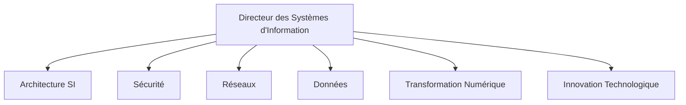
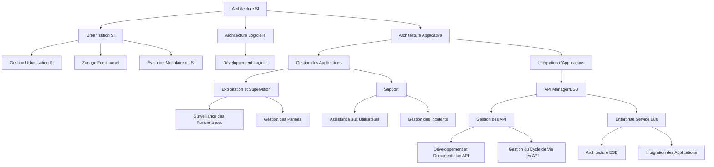
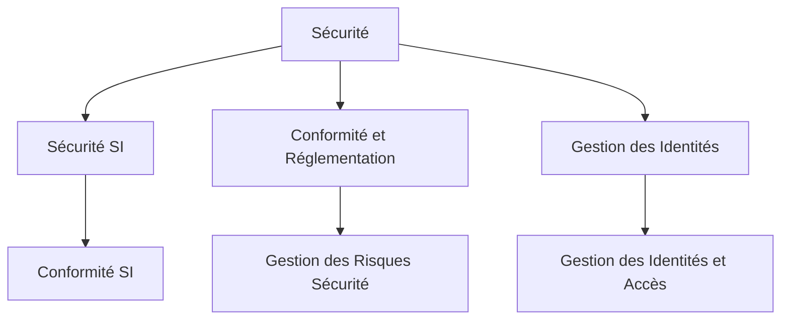
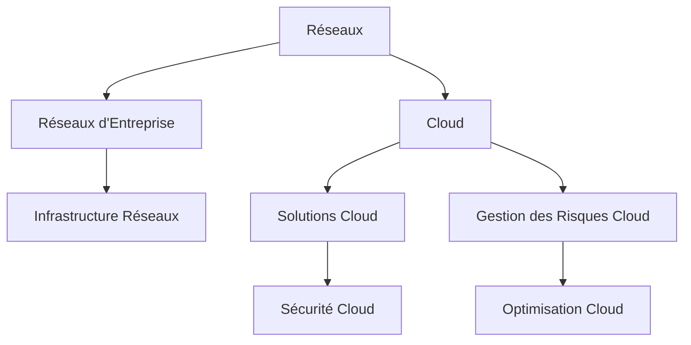
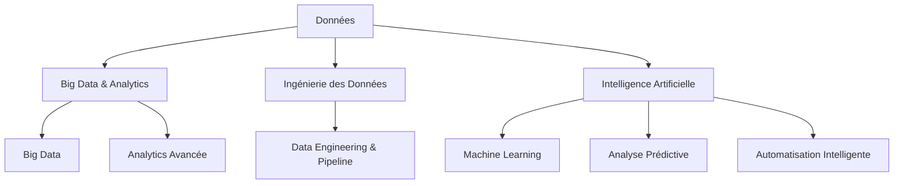
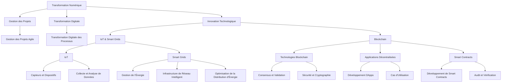

## Schéma Global Simplifié

------------------

Pour le diagramme de gestion de la direction des systèmes d'information (DSI), nous allons créer des tableaux détaillés pour chaque axe mentionné : Architecture SI, Sécurité, Réseaux, Données, Transformation Numérique, et Innovation Technologique. Chaque tableau inclura des exemples, des outils associés, des avantages, des inconvénients, et des bonnes pratiques.

---

### 1. Architecture SI

---

#### 1. Urbanisation SI

| **Aspect**                | **Exemples**                               | **Outils**                           | **Avantages**                                | **Inconvénients**                           | **Bonnes Pratiques**                                    |
|---------------------------|--------------------------------------------|-------------------------------------|---------------------------------------------|--------------------------------------------|---------------------------------------------------------|
| **Modélisation de l'Urbanisation** | Modèle d'urbanisation d'un SI complexe     | ArchiMate, UML, Enterprise Architect | Permet de visualiser l'organisation et les relations entre les systèmes | Peut être complexe à mettre à jour régulièrement | Utiliser des standards de modélisation reconnus, impliquer les parties prenantes dans la validation |
| **Conception de l'Urbanisation** | Définition des processus métiers et systèmes | TOGAF, Zachman Framework            | Assure une cohérence dans l'alignement des processus et des systèmes | Peut nécessiter des ajustements fréquents en fonction des évolutions | Adopter une approche modulaire, réévaluer régulièrement les besoins métiers |
| **Gouvernance et Management** | Gestion des changements dans l'urbanisation | ITIL, COBIT                         | Permet une meilleure gestion et gouvernance des systèmes d'information | Peut engendrer une lourdeur administrative | Mettre en place des processus de gestion du changement, documenter les modifications |

### 2. Architecture Logicielle

| **Aspect**                | **Exemples**                               | **Outils**                           | **Avantages**                                | **Inconvénients**                           | **Bonnes Pratiques**                                    |
|---------------------------|--------------------------------------------|-------------------------------------|---------------------------------------------|--------------------------------------------|---------------------------------------------------------|
| **Conception Architecturale** | Définition des patterns et des structures logicielles | UML, Design Patterns                 | Facilite la création de systèmes extensibles et maintenables | Peut introduire une complexité accrue si mal géré | Utiliser des modèles de conception éprouvés, valider les architectures avec des prototypes |
| **Évaluation et Optimisation** | Analyse des performances et de la scalabilité | JProfiler, YourKit                   | Permet d'optimiser les performances des systèmes | Peut nécessiter des ajustements fréquents en fonction des charges | Effectuer des revues régulières, intégrer les feedbacks des utilisateurs |
| **Intégration et Interopérabilité** | Gestion des interfaces entre modules logiciels | API Management Tools, Swagger        | Assure la compatibilité entre différentes parties du système | Peut nécessiter des efforts de coordination importants | Définir des standards d'intégration clairs, tester les interfaces de manière exhaustive |

### 3. Architecture Applicative

| **Aspect**                | **Exemples**                               | **Outils**                           | **Avantages**                                | **Inconvénients**                           | **Bonnes Pratiques**                                    |
|---------------------------|--------------------------------------------|-------------------------------------|---------------------------------------------|--------------------------------------------|---------------------------------------------------------|
| **Modélisation Applicative** | Conception des applications et de leurs interactions | ArchiMate, Visio                    | Permet une vue d'ensemble des applications et de leur agencement | Peut être complexe à maintenir à jour | Utiliser des outils de modélisation adaptés, documenter les interactions entre applications |
| **Développement et Déploiement** | Développement d'applications et gestion des versions | Docker, Kubernetes, CI/CD Tools     | Facilite le déploiement continu et l'intégration des applications | Peut nécessiter des compétences techniques spécifiques | Adopter des pratiques DevOps, automatiser les processus de déploiement |
| **Maintenance et Évolution** | Gestion des évolutions et des corrections de bogues | Jira, ServiceNow                      | Permet de gérer efficacement les mises à jour et les correctifs | Peut entraîner une gestion complexe des versions | Mettre en place un système de gestion des changements, planifier les évolutions en fonction des besoins |

---

Ces tableaux détaillent les aspects clés de chaque sous-catégorie de l'architecture des systèmes d'information, fournissant des informations pratiques, des outils recommandés, des avantages, des inconvénients, et des bonnes pratiques pour chaque domaine. Ajustez les détails en fonction des spécificités de votre organisation ou de votre projet.

-----------------------------------
--------------------------------
## 2. Sécurité

| **Aspect**           | **Exemples**                          | **Outils**                          | **Avantages**                              | **Inconvénients**                           | **Bonnes Pratiques**                                    |
|----------------------|---------------------------------------|------------------------------------|-------------------------------------------|--------------------------------------------|---------------------------------------------------------|
| **Gestion des Risques** | Identification et évaluation des risques | Nessus, Qualys                    | Réduit les risques de sécurité, améliore la résilience | Peut être coûteux et complexe à mettre en œuvre | Effectuer des analyses de risques régulières, maintenir des politiques de sécurité à jour |
| **Protection des Données** | Cryptage des données sensibles      | VeraCrypt, BitLocker               | Protège les données contre les accès non autorisés | Peut affecter les performances du système | Utiliser des algorithmes de cryptage robustes, gérer les clés de manière sécurisée |
| **Réponse aux Incidents** | Gestion des incidents de sécurité     | SIEM (Splunk, ELK)                 | Permet une réaction rapide aux incidents de sécurité | Peut générer un volume élevé d'alertes à analyser | Établir des procédures claires de réponse aux incidents, former les équipes à la gestion des incidents |

-----------------------------------------
## 3. Réseaux

| **Aspect**           | **Exemples**                           | **Outils**                          | **Avantages**                               | **Inconvénients**                           | **Bonnes Pratiques**                                    |
|----------------------|----------------------------------------|------------------------------------|--------------------------------------------|--------------------------------------------|---------------------------------------------------------|
| **Conception du Réseau** | Architecture des réseaux locaux et étendus | Cisco Packet Tracer, GNS3          | Assure une connectivité efficace et sécurisée | Peut être complexe à concevoir pour des environnements vastes | Planifier la topologie du réseau en fonction des besoins, utiliser des outils de simulation |
| **Gestion du Réseau** | Surveillance et gestion des performances | Nagios, PRTG Network Monitor        | Permet de détecter et résoudre les problèmes rapidement | Peut nécessiter une surveillance constante | Configurer des alertes pour les anomalies, effectuer une maintenance préventive |
| **Sécurité du Réseau** | Protection contre les attaques réseau  | Firewall, IDS/IPS (Snort)           | Protège le réseau contre les menaces externes | Peut introduire des latences ou des points de défaillance | Mettre en place des politiques de sécurité réseau, utiliser des systèmes de détection d'intrusion |

-----------------------------------------------
## 4. Données

| **Aspect**           | **Exemples**                           | **Outils**                          | **Avantages**                               | **Inconvénients**                           | **Bonnes Pratiques**                                    |
|----------------------|----------------------------------------|------------------------------------|--------------------------------------------|--------------------------------------------|---------------------------------------------------------|
| **Gestion des Données** | Administration des bases de données   | SQL Server, Oracle, MySQL          | Assure l'intégrité et la disponibilité des données | Peut être coûteux en termes de ressources | Mettre en œuvre des stratégies de sauvegarde et de restauration, optimiser les performances des bases de données |
| **Analyse des Données** | Traitement et analyse des données     | Tableau, Power BI, Hadoop          | Fournit des insights précieux pour la prise de décision | Peut nécessiter une expertise en analyse de données | Utiliser des outils d'analyse appropriés, garantir la qualité des données |
| **Gouvernance des Données** | Conformité et gestion de la qualité des données | Data Governance Tools (Collibra)  | Assure la conformité réglementaire et la qualité des données | Peut introduire des processus supplémentaires | Définir des politiques de gouvernance claires, effectuer des audits réguliers |

----------------------------------

## 5. Transformation Numérique

| **Aspect**           | **Exemples**                           | **Outils**                          | **Avantages**                              | **Inconvénients**                           | **Bonnes Pratiques**                                    |
|----------------------|----------------------------------------|------------------------------------|-------------------------------------------|--------------------------------------------|---------------------------------------------------------|
| **Stratégie de Transformation** | Mise en œuvre de nouvelles technologies | Digital Transformation Platforms   | Améliore l'efficacité et l'agilité de l'entreprise | Peut rencontrer une résistance au changement | Développer une feuille de route claire, impliquer les parties prenantes |
| **Adoption des Technologies** | Intégration de l'IA, IoT, Cloud        | AWS, Azure, Google Cloud            | Offre des opportunités d'innovation, améliore les capacités opérationnelles | Peut nécessiter des investissements importants | Choisir des technologies adaptées aux besoins, former le personnel aux nouvelles compétences |
| **Changement Organisationnel** | Gestion du changement et formation      | Change Management Tools (Prosci)   | Facilite la transition vers des modèles opérationnels numériques | Peut nécessiter une gestion active des ressources humaines | Communiquer clairement les objectifs, fournir un soutien et une formation adéquate |

---------------------------------------------

## 6. Innovation Technologique

| **Aspect**           | **Exemples**                           | **Outils**                          | **Avantages**                               | **Inconvénients**                           | **Bonnes Pratiques**                                    |
|----------------------|----------------------------------------|------------------------------------|--------------------------------------------|--------------------------------------------|---------------------------------------------------------|
| **Veille Technologique** | Surveillance des tendances émergentes | TechCrunch, Gartner, Forrester      | Permet de rester à la pointe de la technologie | Peut être difficile de filtrer les informations pertinentes | Suivre les rapports de recherche, participer à des conférences et événements |
| **Recherche et Développement** | Développement de nouveaux produits et services | IDEs, Outils de prototypage          | Stimule l'innovation, crée des avantages concurrentiels | Peut être coûteux et risqué | Allouer des ressources dédiées à R&D, tester les prototypes auprès des utilisateurs finaux |
| **Gestion des Projets Innovants** | Gestion de projets de recherche et d'innovation | Jira, Trello, Asana                 | Permet une gestion efficace des projets innovants | Peut nécessiter une expertise en gestion de projets | Définir des objectifs clairs, suivre les progrès régulièrement |

---

Ces tableaux détaillés offrent une vue complète des différents aspects de la gestion des systèmes d'information, fournissant des informations pratiques et des recommandations pour chaque domaine clé. N'hésitez pas à ajuster les exemples, outils, avantages, inconvénients et bonnes pratiques en fonction des besoins spécifiques de votre organisation ou de votre projet.
------------------

### Détails Supplémentaires - Architecture SI

---

### Détails du Schéma

#### **1. Urbanisation SI**
   - **Gestion Urbanisation SI :** Planification et organisation du système d'information pour optimiser son architecture.
   - **Zonage Fonctionnel :** Définition des zones fonctionnelles pour améliorer la modularité.
   - **Évolution Modulaire du SI :** Gestion de l'évolution des modules pour répondre aux besoins changeants.

#### **2. Architecture Logicielle**
   - **Développement Logiciel :** Pratiques et outils pour concevoir, coder et tester des applications logicielles.

#### **3. Architecture Applicative**
   - **Gestion des Applications :** Administration complète des applications informatiques.
     - **Exploitation et Supervision :**
       - **Surveillance des Performances :** Suivi des performances des applications pour assurer leur bon fonctionnement.
       - **Gestion des Pannes :** Réponse rapide aux problèmes pour minimiser les interruptions de service.
     - **Support :**
       - **Assistance aux Utilisateurs :** Aide aux utilisateurs finaux pour résoudre les problèmes d'utilisation.
       - **Gestion des Incidents :** Suivi et résolution des incidents pour maintenir la qualité du service.
   - **Intégration d'Applications :**
     - **API Manager/ESB :**
       - **Gestion des API :** Administration des API pour assurer leur bon fonctionnement et leur intégration.
         - **Développement et Documentation API :** Création et documentation des API pour une intégration efficace.
         - **Gestion du Cycle de Vie des API :** Suivi et mise à jour des API tout au long de leur cycle de vie.
       - **Enterprise Service Bus :** Facilitation de l'intégration entre les différentes applications.
         - **Architecture ESB :** Conception de l'architecture du bus de services pour l'intégration.
         - **Intégration des Applications :** Connexion et orchestration des applications via le bus de services.

Ce schéma simplifié permet de visualiser clairement la structure de l'Architecture SI en mettant en évidence les principaux aspects de la gestion des applications, avec un focus particulier sur l'intégration et l'exploitation.

### Explications des Modifications :

1. **Gestion des Applications** et **Intégration d'Applications** sont maintenant regroupés sous **Architecture Applicative** pour éviter les doublons.
2. **API Manager/ESB** a été déplacé sous **Intégration d'Applications**, ce qui simplifie l'organisation et la hiérarchie des composants.
3. Les détails sur la gestion des API et l'Enterprise Service Bus sont inclus dans le sous-bloc **Intégration d'Applications**, consolidant ainsi les éléments associés.

### Détails Supplémentaires - Gestion des Applications

La **Gestion des Applications** est une discipline cruciale dans l'architecture des systèmes d'information. Elle couvre l'ensemble des pratiques et outils nécessaires pour gérer efficacement les applications au cours de leur cycle de vie, depuis le développement initial jusqu'à leur déploiement, maintenance, et mise hors service. Voici un aperçu détaillé de la Gestion des Applications, y compris ses outils, bonnes pratiques, et processus associés.

---

#### **Définition**

La Gestion des Applications englobe l'administration, le déploiement, la maintenance, et l'optimisation des applications informatiques. Cela inclut la coordination des ressources nécessaires pour assurer le bon fonctionnement des applications, l'amélioration continue de leurs performances, et leur alignement avec les besoins métier.

---

#### **Composantes Clés**

1. **Développement et Déploiement**
   - **Développement Logiciel :** Conception, codage, et test des applications en utilisant des méthodologies et des outils adaptés pour assurer la qualité et la performance.
   - **Déploiement :** Processus d'installation des applications dans des environnements de production, y compris la configuration et la validation.

2. **Maintenance et Support**
   - **Maintenance :** Gestion des mises à jour, des correctifs, et des améliorations pour assurer la continuité du service et la sécurité des applications.
   - **Support :** Assistance aux utilisateurs pour résoudre les problèmes et répondre aux demandes concernant les applications.

3. **Surveillance et Optimisation**
   - **Surveillance :** Suivi des performances des applications pour détecter et résoudre les problèmes potentiels avant qu'ils n'affectent les utilisateurs.
   - **Optimisation :** Amélioration des performances et de l'efficacité des applications en ajustant les configurations et en mettant en œuvre des améliorations.

4. **Intégration d'Applications**
   - **API Manager/ESB :** Outils et pratiques pour connecter les différentes applications, faciliter les échanges de données, et garantir l'interopérabilité.

---

#### **Outils de Gestion des Applications**

1. **Outils de Développement**
   - **IDE (Integrated Development Environment) :** Environnements de développement intégrés pour coder et tester les applications. Exemple : **Visual Studio**, **IntelliJ IDEA**.
   - **Systèmes de Gestion de Versions (VCS) :** Outils pour gérer les versions du code source. Exemple : **Git**, **Subversion (SVN)**.

2. **Outils de Déploiement**
   - **CI/CD (Continuous Integration/Continuous Deployment) :** Outils pour automatiser le processus de construction, de test, et de déploiement des applications. Exemple : **Jenkins**, **GitLab CI**, **CircleCI**.
   - **Outils de Conteneurisation :** Technologies pour empaqueter les applications et leurs dépendances dans des conteneurs. Exemple : **Docker**, **Kubernetes**.

3. **Outils de Maintenance et Support**
   - **Systèmes de Gestion des Tickets :** Outils pour suivre et gérer les demandes et les incidents. Exemple : **Jira**, **ServiceNow**.
   - **Outils de Gestion des Pannes :** Outils pour surveiller et résoudre les problèmes de performance. Exemple : **Nagios**, **Datadog**.

4. **Outils de Surveillance et Optimisation**
   - **Outils de Surveillance des Performances :** Outils pour surveiller la performance des applications en temps réel. Exemple : **New Relic**, **AppDynamics**.
   - **Outils d'Analyse des Logs :** Outils pour analyser les journaux d'application et détecter les anomalies. Exemple : **ELK Stack (Elasticsearch, Logstash, Kibana)**.

5. **Intégration d'Applications**
   - **API Manager :** Outils pour gérer les API, contrôler l'accès, et surveiller leur utilisation. Exemple : **Apigee**, **Kong**.
   - **ESB (Enterprise Service Bus) :** Outils pour orchestrer les échanges de données entre les applications. Exemple : **WSO2 ESB**, **MuleSoft Anypoint Platform**.

---

#### **Bonnes Pratiques**

1. **Adopter des Méthodologies Agiles :**
   - Utiliser des approches agiles comme **Scrum** ou **Kanban** pour améliorer la flexibilité et la réactivité du développement et de la gestion des applications.

2. **Automatiser les Tests et le Déploiement :**
   - Mettre en place des processus d'intégration continue et de déploiement continu (CI/CD) pour automatiser les tests et les déploiements, réduisant ainsi les erreurs humaines et accélérant le cycle de livraison.

3. **Mettre en Place une Surveillance Proactive :**
   - Utiliser des outils de surveillance pour suivre les performances des applications et détecter les problèmes avant qu'ils n'affectent les utilisateurs.

4. **Documenter les Processus et les APIs :**
   - Maintenir une documentation claire et à jour des processus de développement, des API, et des configurations pour faciliter la gestion et la maintenance des applications.

5. **Gérer les Versions et les Dépendances :**
   - Utiliser des systèmes de gestion de versions et des outils pour gérer les dépendances des applications afin de garantir la cohérence et la qualité des déploiements.

6. **Assurer la Sécurité des Applications :**
   - Intégrer des pratiques de sécurité dès le développement (DevSecOps) et effectuer des audits réguliers pour identifier et corriger les vulnérabilités.

---

En intégrant ces pratiques et en utilisant les outils appropriés, la gestion des applications devient plus efficace et mieux alignée avec les objectifs métiers, tout en assurant une meilleure qualité et une gestion optimale des ressources informatiques.
### Détails Supplémentaires - Sécurité

### Détails Supplémentaires - Réseaux et Cloud

### Détails Supplémentaires - Données et Intelligence Artificielle

### Détails Supplémentaires - Transformation Numérique et Innovation Technologique

Ce schéma simplifié regroupe les éléments principaux sous **Architecture SI**, tout en conservant les sous-éléments comme **API Manager/ESB** et **Gestion des Applications**. Les autres domaines sont structurés pour refléter leur relation avec l'architecture et les spécificités fonctionnelles.
