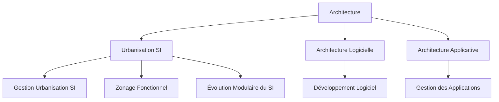
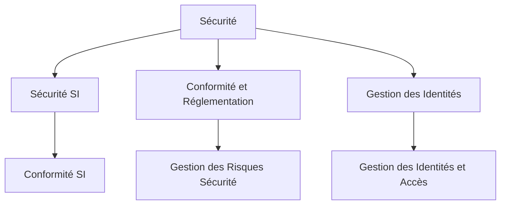
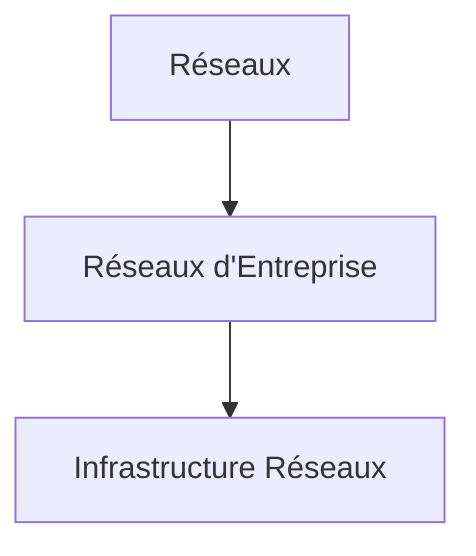
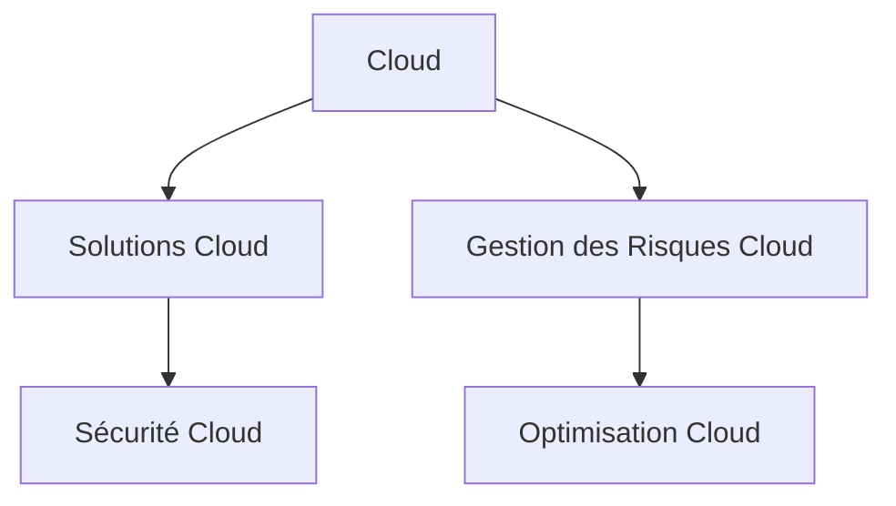
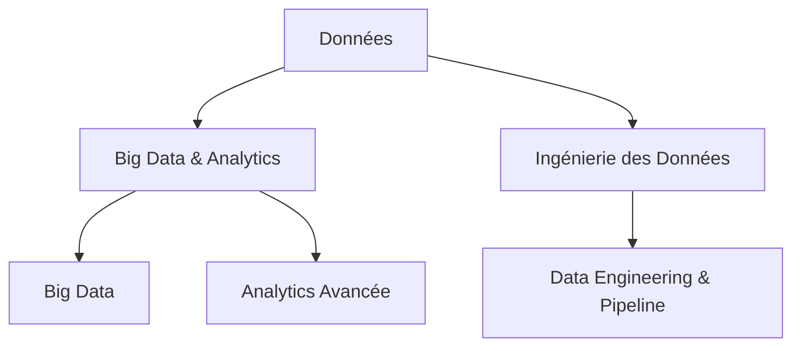
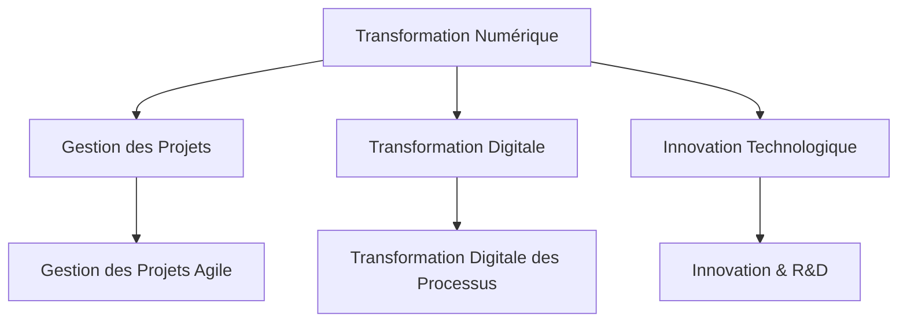
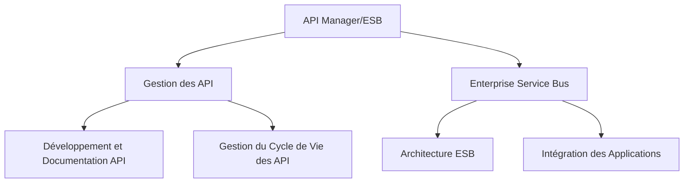
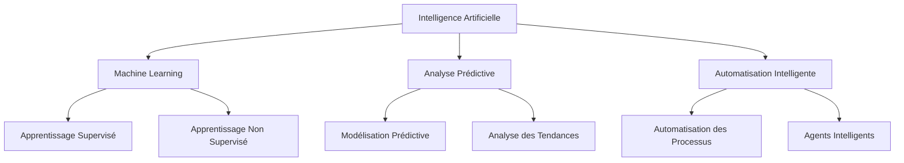
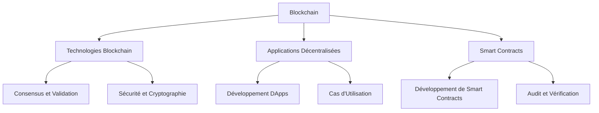

Voici la version mise à jour du schéma détaillé avec des sous-schémas pour chaque axe, incluant les concepts d'API Manager/ESB, d'intelligence artificielle, et de blockchain :

### Schéma Global

```mermaid
graph TD
    A[Directeur des Systèmes d'Information] --> B[Architecture]
    A --> C[Sécurité]
    A --> D[Réseaux]
    A --> E[Cloud]
    A --> F[Données]
    A --> G[Transformation Numérique]
    A --> H[API Manager/ESB]
    A --> I[Intelligence Artificielle]
    A --> J[Blockchain]

    %% Architecture
    B --> B1[Urbanisation SI]
    B --> B2[Architecture Logicielle]
    B --> B3[Architecture Applicative]

    %% Sécurité
    C --> C1[Sécurité SI]
    C --> C2[Conformité et Réglementation]
    C --> C3[Gestion des Identités]

    %% Réseaux
    D --> D1[Réseaux d'Entreprise]

    %% Cloud
    E --> E1[Solutions Cloud]
    E --> E2[Gestion des Risques Cloud]

    %% Données
    F --> F1[Big Data & Analytics]
    F --> F2[Ingénierie des Données]

    %% Transformation Numérique
    G --> G1[Gestion des Projets]
    G --> G2[Transformation Digitale]
    G --> G3[Innovation Technologique]

    %% API Manager/ESB
    H --> H1[Gestion des API]
    H --> H2[Enterprise Service Bus]

    %% Intelligence Artificielle
    I --> I1[Machine Learning]
    I --> I2[Analyse Prédictive]
    I --> I3[Automatisation Intelligente]

    %% Blockchain
    J --> J1[Technologies Blockchain]
    J --> J2[Applications Décentralisées]
    J --> J3[Smart Contracts]
```

### Détails Supplémentaires - Architecture

### Détails Supplémentaires - Sécurité

### Détails Supplémentaires - Réseaux

### Détails Supplémentaires - Cloud

### Détails Supplémentaires - Données

### Détails Supplémentaires - Transformation Numérique

### Détails Supplémentaires - API Manager/ESB

### Détails Supplémentaires - Intelligence Artificielle

### Détails Supplémentaires - Blockchain

Chaque schéma détaillé présente les sous-domaines spécifiques, permettant de mieux comprendre les différentes facettes et processus associés à chaque axe de la direction des systèmes d'information.
