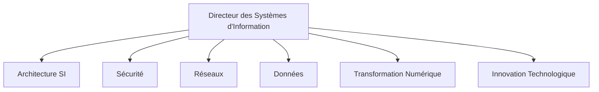
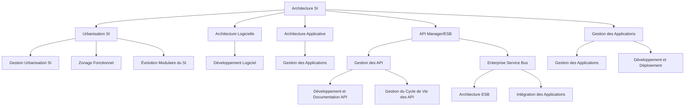
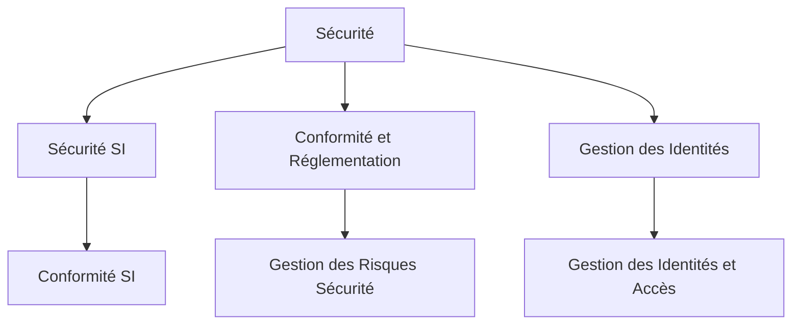
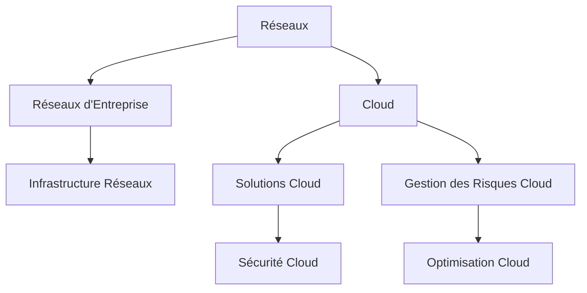
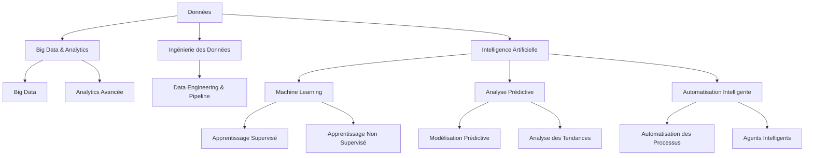
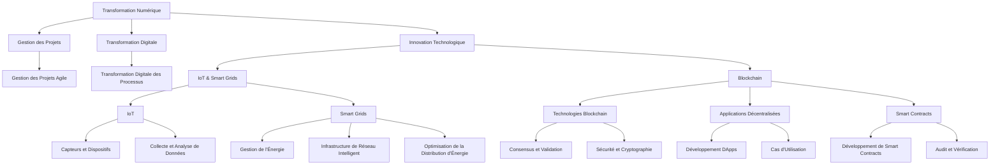

### Schéma Global Mis à Jour

### Détails Supplémentaires - Architecture SI

### Détails Supplémentaires - Sécurité

### Détails Supplémentaires - Réseaux et Cloud

### Détails Supplémentaires - Données et Intelligence Artificielle

### Détails Supplémentaires - Transformation Numérique et Innovation Technologique

Avec cette simplification :
- **Cloud** est intégré comme un sous-composant de **Réseaux**.
- **IoT** et **Smart Grids** sont regroupés sous **Innovation Technologique**.
- **Blockchain** est également inclus sous **Innovation Technologique**.

Cela permet de maintenir une structure claire tout en intégrant tous les aspects importants.
