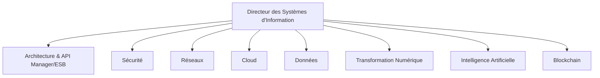
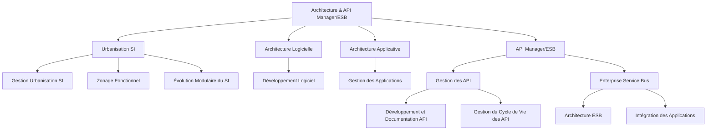
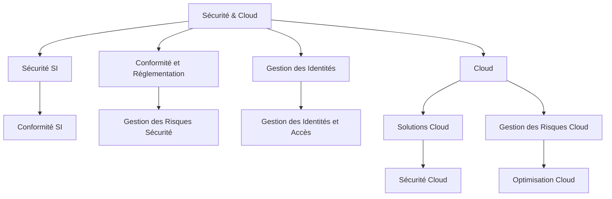
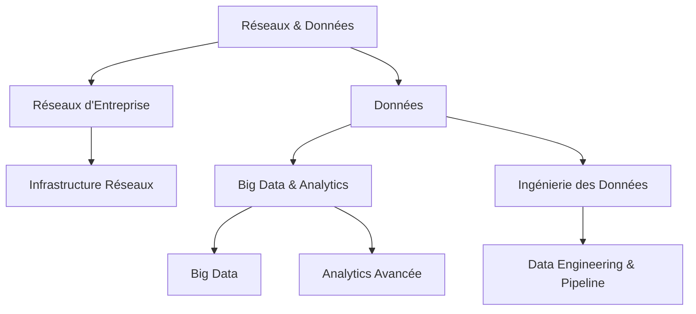
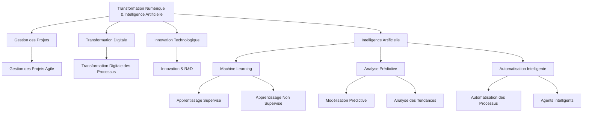

### Schéma Global

### Détails Supplémentaires - Architecture & API Manager/ESB

### Détails Supplémentaires - Sécurité & Cloud

### Détails Supplémentaires - Réseaux & Données

### Détails Supplémentaires - Transformation Numérique & Intelligence Artificielle

### Détails Supplémentaires - Blockchain

Ces schémas regroupent les axes principaux en deux grands domaines pour chaque schéma, facilitant la compréhension des relations et des processus associés.
